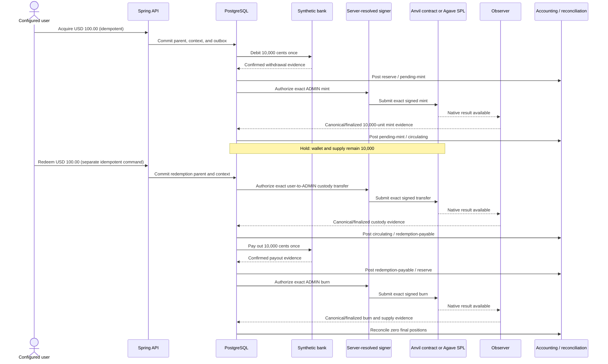
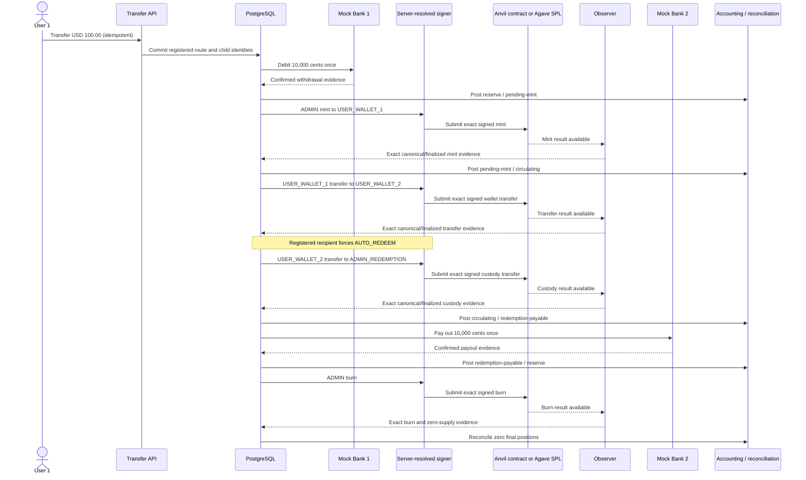

# Digital Banking POC Walkthrough

## What this POC demonstrates

This repository demonstrates a non-production Java/Spring control plane for two
exact, synthetic `USD 100.00` (`10,000` cents / `10,000` two-decimal token
units) workflows:

- **Demo A — user-held acquisition, hold, and redemption:** one configured user
  exchanges synthetic dollars for USDZELLE, retains the tokens, and later
  redeems them.
- **Demo B — settlement-only transfer with forced recipient `AUTO_REDEEM`:**
  synthetic dollars move from User 1's bank account to User 2's bank account;
  USDZELLE exists only inside the settlement saga.

Both demonstrations run through the same durable business workflows on either
local Ethereum or local Solana. PostgreSQL owns business truth: accepted
commands, synthetic banking, workflow, accounting, outbox/delivery, chain
attempt, observation, finality, and reconciliation records. A transaction hash,
receipt, signature, slot, or commitment is external-effect evidence; it is not
the business system of record or proof of financial settlement.

The POC uses fake bank accounts, disposable local keys, private local chains,
and a synthetic ledger. It does not move real money, establish reserves, provide
production custody, reach a public network, or determine legal, accounting, or
customer-visible finality.

## Runtime and chain realization

| Concern | Ethereum | Solana |
| --- | --- | --- |
| Local chain | Anvil | Private Agave validator |
| Token realization | Custom two-decimal `LocalReferenceToken` Solidity contract | Two-decimal classic-SPL mint governed by the standard SPL Token Program |
| Bootstrap | Offline Foundry build plus one-shot contract deployment and role verification | Create the mint plus canonical associated token accounts |
| Java adapter | Web3j | Sava |
| Custom on-chain program | The minimal Solidity contract | None; no custom Rust/Anchor program |
| Business system of record | PostgreSQL | PostgreSQL |
| Process placement | PostgreSQL, Anvil, deployer, and packaged Java run in Docker | PostgreSQL runs in Docker; Agave and packaged Java run on the host |

Starting Ethereum builds the existing contract offline, packages the control
plane with tests skipped, starts the digest-pinned loopback-only services,
deploys or verifies the contract and ADMIN roles, and waits for readiness.
Starting Solana packages the same control plane with tests skipped, starts the
cached PostgreSQL service and host-native private validator, creates a fresh
classic-SPL mint and canonical USER_1, USER_2, and ADMIN associated token
accounts, starts host-native Java, and waits for readiness. Solana creates a
mint; it does not deploy a custom program.

```mermaid
flowchart LR
    caller["Configured participant / local operator"]
    api["Spring REST control plane"]
    db[("PostgreSQL\nworkflow, bank, ledger, attempts, evidence")]
    worker["Outbox / durable worker"]
    signer["Server-resolved local signer"]
    adapter{"Selected local chain adapter"}
    web3j["Web3j"]
    sava["Sava"]
    anvil["Anvil + LocalReferenceToken"]
    agave["Agave + standard SPL Token Program"]
    observe["Independent inquiry / observation"]
    recon["Accounting, finality, reconciliation"]

    caller -->|"business command"| api
    api -->|"atomic acceptance"| db
    db -->|"committed work"| worker
    worker -->|"authorized exact effect"| signer
    signer -->|"exact signature evidence"| adapter
    adapter --> web3j -->|"signed EVM transaction"| anvil
    adapter --> sava -->|"signed Solana transaction"| agave
    anvil -.->|"receipt, event, canonical block"| observe
    agave -.->|"signature, instruction, finalized slot"| observe
    observe -.->|"independently read evidence"| db
    db --> recon
```



Solid arrows carry commands or committed work outward. Dotted arrows carry
observed evidence back. No edge represents a distributed ACID transaction, and
authentication, signing, submission, observation, and reconciliation do not
grant one another transitive authority.

## Durable state and accounting

PostgreSQL keeps the parent and child workflow identities, idempotency bindings,
synthetic bank operations and balances, the append-only accounting journal,
outbox/inbox delivery state, signer decisions, chain attempts/submissions,
native observation references, four distinct finality histories, and
reconciliation conclusions. External calls occur outside the narrow database
transactions that commit those records.

The closed synthetic dollar ledger has exactly four accounts:

- `RESERVE_CASH_ASSET`
- `FIAT_RECEIVED_PENDING_MINT_LIABILITY`
- `USDZELLE_CIRCULATING_LIABILITY`
- `REDEMPTION_PAYABLE_LIABILITY`

| Confirmed event | Debit | Credit |
| --- | --- | --- |
| Bank withdrawal | `RESERVE_CASH_ASSET` | `FIAT_RECEIVED_PENDING_MINT_LIABILITY` |
| Token mint | `FIAT_RECEIVED_PENDING_MINT_LIABILITY` | `USDZELLE_CIRCULATING_LIABILITY` |
| Redemption custody | `USDZELLE_CIRCULATING_LIABILITY` | `REDEMPTION_PAYABLE_LIABILITY` |
| Bank payout | `REDEMPTION_PAYABLE_LIABILITY` | `RESERVE_CASH_ASSET` |

Confirmed burn reduces the operational
`ADMIN_REDEMPTION_CUSTODY_PENDING_BURN` and confirmed-chain-supply positions.
It does not create a second dollar journal. Evidence is consumed once; a
missing, stale, mismatched, non-final, or already-consumed fact fails closed.

## Demo A — user-held acquisition, hold, and redemption

1. The participant submits an exact acquisition command. PostgreSQL durably
   accepts the parent and its immutable, server-resolved bank, wallet, network,
   asset/unit, policy, and child context.
2. The synthetic bank debits User 1 once from `10,000` cents to zero.
3. Confirmed withdrawal evidence posts reserve cash and pending-mint liability.
4. ADMIN authorizes the exact mint. On Ethereum ADMIN signs the contract call;
   on Solana the fee payer and mint authority sign the classic-SPL mint.
5. Observation proves exactly `10,000` atomic units reached the configured
   `USER_WALLET_1`; accounting moves pending-mint to circulating liability.
6. The workflow pauses at the demonstrated hold checkpoint: the user wallet and
   total supply are `10,000`, and reserve cash and circulating liability are
   `10,000` cents.
7. A later, separately idempotent redemption command transfers the full amount
   from the server-controlled user custody wallet to `ADMIN_REDEMPTION`. The
   user-wallet authority signs; on Solana the configured fee payer also signs.
8. Confirmed custody evidence moves circulating liability to redemption payable.
9. The synthetic bank pays User 1 once, restoring the bank balance to `10,000`
   cents and posting redemption payable against reserve cash.
10. Only after payout accounting, ADMIN signs and executes the exact burn.
11. Observation and reconciliation confirm zero user/ADMIN balances, custody,
    reserve, dollar liabilities, and token supply.



Replaying either command returns the original durable resource and creates no
second debit, mint, payout, custody transfer, or burn. The result proves a
bounded segregated-custody local workflow, not self-custody, a production
user-balance product, a real reserve, or production redemption.

## Demo B — settlement-only transfer with forced `AUTO_REDEEM`

1. User 1 submits one exact settlement-only transfer. PostgreSQL accepts the
   registered route with server-resolved participants, bank accounts, wallet
   aliases/addresses/versions, network, policy, and child identities.
2. Mock Bank 1 debits User 1 once from `10,000` cents to zero.
3. ADMIN mints exactly `10,000` units to the server-owned
   `USER_WALLET_1` alias.
4. The `USER_WALLET_1` authority signs one exact transfer to the server-owned
   `USER_WALLET_2` alias; a Solana fee payer co-signs the native transaction.
5. The registered recipient instruction forces `AUTO_REDEEM` rather than token
   retention. `USER_WALLET_2` signs the exact custody transfer to
   `ADMIN_REDEMPTION`.
6. After confirmed custody/accounting, Mock Bank 2 pays User 2 once from zero to
   `10,000` cents.
7. ADMIN signs the exact burn, and final observation/reconciliation confirms all
   reserve, liability, custody, wallet, ADMIN, and supply positions are zero.



An exact replay retains the same parent and all six confirmed-effect counts at
one. The local proof uses segregated server-owned user aliases to demonstrate
the settlement-only economic result; callers cannot select them and the
recipient cannot retain the balance. Arbitrary institutional
bank-settlement-wallet routing remains future work. This result is not a real
bank transfer, a globally atomic transaction, or production settlement.

## Start, stop, reset, and environment handoff

Only one local demo environment may run at a time.

| Environment | Start creates | State location | Ordinary stop | Explicit reset |
| --- | --- | --- | --- | --- |
| Ethereum | Docker PostgreSQL, Anvil, one-shot deployer, packaged control plane, deployed contract and roles | Named PostgreSQL/Anvil volumes plus ignored `.demo-runtime/`; local fixture keys remain in ignored `.env.local-anvil` | `scripts/demo/stop.sh` preserves named volumes and ignored runtime files | `scripts/demo/reset.sh --yes` destroys only named Phase 6D database/chain/runtime state |
| Solana | Docker PostgreSQL plus host-native Agave and packaged Java; classic-SPL mint and canonical associated accounts | Named PostgreSQL volume plus ignored `.demo-runtime/solana/` ledger, keys, identities, metadata, logs, and summaries | `scripts/demo/solana/stop.sh` preserves the database, ledger, and ignored runtime state | `scripts/demo/solana/reset.sh --yes` destroys only named Phase 7F database/ledger/runtime state |

Before starting Solana, preserve and stop Ethereum:

```bash
scripts/demo/stop.sh
```

Before starting Ethereum, preserve and stop Solana:

```bash
scripts/demo/solana/stop.sh
```

Use reset only when destructive removal of that environment's named state is
intended. Neither reset command stops the other environment.

Follow the [local Ethereum runbook](runbooks/LOCAL_ETHEREUM_DEMO.md) or the
[local Solana runbook](runbooks/LOCAL_SOLANA_DEMO.md) for prerequisites, exact
commands, readiness, replay, restart, troubleshooting, and teardown. The
[demonstration contract](TRANSFER_DEMO.md) owns the detailed product and
evidence semantics; the [design](DESIGN.md) and
[implementation roadmap](IMPLEMENTATION.md) remain the architecture and status
authorities.
