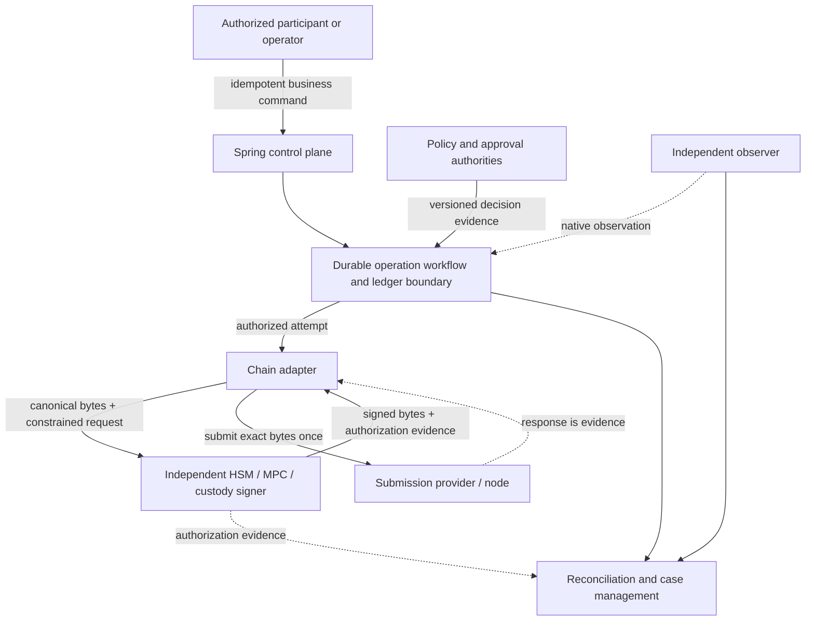
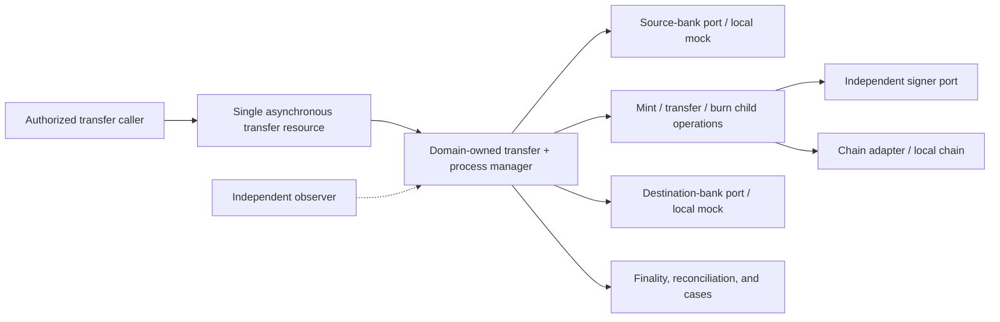
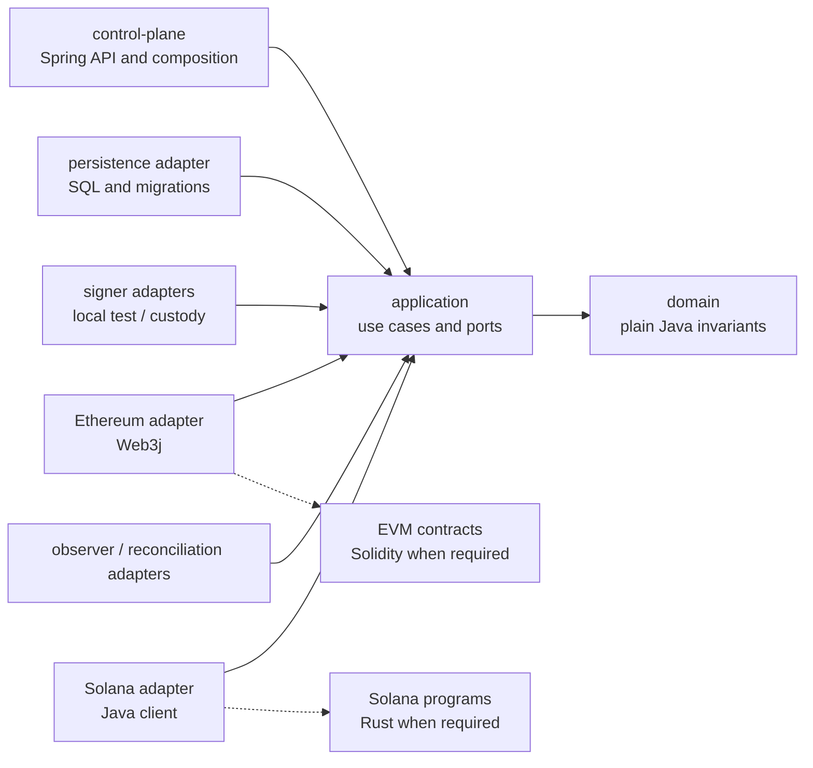
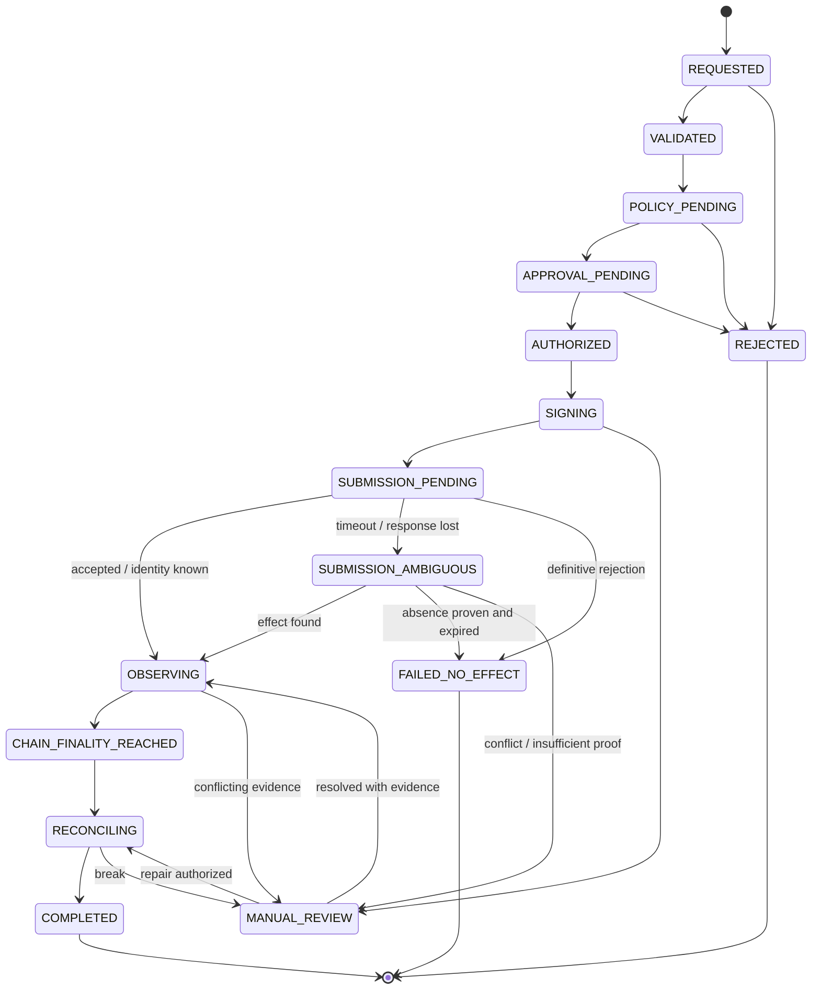

# Digital Banking Reference Implementation Design

## 1. Purpose and authority

This document is the canonical engineering design for a non-production reference implementation of a regulated digital-asset settlement control plane. It translates the verified [source publications](reference/README.md) and contextual architecture review into implementable boundaries while keeping evidence, assumptions, and unresolved decisions explicit.

The publications are architecture inputs, not code specifications. Accepted ADRs, versioned API contracts, and tests refine this design. When they disagree, resolve the conflict explicitly and update this document; do not let implementation drift become an accidental decision.

Zelle is only a public case study in the publications. This repository is organization-neutral and makes no claim about confidential or deployed Early Warning Services/Zelle systems, vendors, controls, or plans.

## 2. Goals, non-goals, and current POC boundary

### Goals

- Demonstrate a Java/Spring regulated control plane with durable, explainable operation state.
- Make mint and burn privileged asynchronous operations rather than direct private-key calls.
- Enforce exact quantity, idempotency, stable identity, approval, attempt, evidence, and reconciliation invariants.
- Isolate chain and signer technology behind ports while preserving native Ethereum and Solana semantics.
- Recover safely from duplicates, timeouts, ambiguous submission, observation disagreement, and reconciliation breaks.
- Provide independently testable layers, local infrastructure, and evidence-gated delivery.
- Support distinct settlement-only and user-held USDZELLE product paths through explicit durable operations without claiming distributed atomicity.

### Non-goals

- Production deployment, legal/compliance approval, real funds, mainnet, or public testnets.
- Reproducing a Zelle product or claiming knowledge of confidential EWS architecture.
- Selecting an issuer, stablecoin, chain, bridge, custody/HSM/MPC provider, or production node provider.
- A consumer wallet application, production custody system, custom bridge, full cross-border product, or complete double-entry ledger in the first slices.
- Making Ethereum and Solana identical behind a lowest-common-denominator API.
- Real bank integration, production settlement wallets, or a synchronous transaction spanning a bank and blockchain.

### Current implementation boundary

The current repository contains documentation, plain-Java exact operation, transfer, signing, synthetic-bank, and accounting invariants, framework-free application use cases/ports, PostgreSQL, local-signer, and Ethereum-Web3j adapters, a minimal local reference token, and a Spring Boot control plane. Phases 3A-3C provide durable token-operation/transfer acceptance, delivery/recovery, and only the first internal transfer preparation. Phases 4A-4B provide durable signing authority and session-only local signing. Phases 5A-5D provide bounded local-Anvil mint, configured custody, user-wallet transfer, redemption custody, and ADMIN burn primitives. Phase 6A adds exact durable synthetic withdrawals/deposits/inquiry plus a closed append-only reserve/liability ledger and supply/custody reconciliation under `local-demo`. These bank, accounting, and chain primitives remain independently invoked; there is no automatic on-ramp, payout/burn ordering, settlement parent, production accounting/reserve, public wallet-transfer API, production custody/network, Solana adapter, Compose environment, or complete product demonstration. The default configuration still has no identity/signer provider, bank/accounting bean, or enabled worker. The [two local demonstrations](TRANSFER_DEMO.md) record this boundary and the remaining workflows.

## 3. Terminology

| Term | Meaning |
| --- | --- |
| Payment intent | A durable business request and obligation context accepted from an authorized participant. A future cross-border product may own this aggregate; the initial token-operation POC does not pretend to implement the entire payment lifecycle. |
| Transfer | A planned durable parent aggregate for one authorized bank-to-bank request. It coordinates child bank effects and token operations while retaining one stable `TransferId`, request identity, route/configuration versions, status, finalities, and evidence. |
| Bank effect | An idempotent withdrawal/deposit behind a provider-neutral port with stable identity, participant scope, exact USD cents, durable outcome/evidence, and inquiry. Phase 6A implements it only for synthetic local fixtures; it never shares a transaction with a chain or accounting posting. |
| Accounting posting | One trusted evidence-driven transition in the closed reserve/liability ledger. It consumes authoritative evidence once and may append a balanced journal and/or update explicit custody/supply positions in the same local transaction. |
| Settlement wallet | A server-configured sender or recipient role used by a local route. Wallet addresses and authorities are resolved from versioned configuration, not caller input. |
| Process manager | A provider-neutral control-plane boundary that coordinates durable work and timers through domain commands/ports. It does not replace domain state, ledger, policy, signing authority, evidence, or reconciliation. |
| Token operation | A privileged durable command to mint or burn an exact quantity under a configured asset, route, policy, and approval context. |
| Chain attempt | One authorized effort to create a specific external chain effect for an operation. It has a stable attempt ID even before a native transaction identity exists. |
| Submission | The one-time handoff of exact signed bytes to a submit provider. A response may be accepted, rejected, or ambiguous. |
| Observation | Evidence gathered through a materially independent read path about native transaction identity, inclusion, canonicality/commitment, logs/instructions, and effect. |
| Reconciliation evidence | A versioned comparison joining internal operation/attempt records with signer, chain, issuer/token, and accounting or inventory evidence. |
| Business truth | Durable internal operation, policy, authorization, ledger, finality, and reconciliation state. Native evidence informs this truth but does not replace it. |

These identities never collapse into one record. The planned relationship is `Transfer -> child bank effects/token operations -> chain attempts -> observations`. A transfer can contain multiple child effects/operations; an operation can contain multiple attempts; an attempt can accumulate multiple observations; reconciliation can reopen a break without rewriting history.

## 4. System context and trust boundaries



Trust does not flow transitively. The API authenticates a caller but does not grant signing authority. The signer approves exact bytes but does not decide customer, legal, or accounting finality. The submit provider can accept bytes but is not the only observation source. The observer reports native facts but cannot authorize value movement.

Personal, sanctions, fraud, case, and policy data remain inside controlled systems. If a chain reference is required, it is an opaque correlation value with no direct personal meaning.

### Planned transfer context



The planned transfer is an asynchronous saga/workflow. Each local state transition, outbox/inbox handoff, bank effect, signing decision, chain attempt, observation, and compensation has its own transaction and durable identity. No diagram edge implies a shared atomic transaction or transitive authority.

## 4A. USDZELLE product paths, ownership, custody, and reserves

[ADR 0008](adr/0008-usdzelle-product-paths-ownership-custody-reserve-boundaries.md) accepts two organization-neutral product paths. `USDZELLE` is a reference asset name; it does not identify a real issuer, deposit product, reserve, or announced Zelle/Early Warning Services service.

### Settlement-only path (Demo A)

The customer holds dollars before and after the payment. USDZELLE exists only as an institutional settlement asset inside this future six-effect saga:

```text
1. Mock Bank 1 debits User 1's bank account by $100.00
2. ADMIN mints 100.00 USDZELLE to BANK_1_SETTLEMENT
3. BANK_1_SETTLEMENT transfers 100.00 USDZELLE to BANK_2_SETTLEMENT
4. BANK_2_SETTLEMENT transfers 100.00 USDZELLE to ADMIN_REDEMPTION
5. Mock Bank 2 credits User 2's bank account by $100.00
6. ADMIN burns the redeemed 100.00 USDZELLE
```

User 1 and User 2 need no blockchain wallets or blockchain signatures. Institution- or custody-controlled settlement wallets sign the native transactions. The current Phase 3C aggregate still records its verified five-effect acceptance model; future Phase 6C must explicitly add the redemption transfer and ADMIN burn boundary rather than relabeling the existing model as this completed six-step flow.

### User-held path (Demo B)

The user can acquire, retain, optionally transfer, and later redeem USDZELLE. On-ramp, wallet transfer, and redemption are separate durable business operations:

```text
On-ramp: bank debit/reserve -> reserve evidence -> ADMIN mint -> USER_WALLET_1
Hold: USER_WALLET_1 retains the balance until a later authorized request
Optional transfer: USER_WALLET_1 -> USER_WALLET_2, without forced redemption
Redemption: user wallet -> ADMIN_REDEMPTION -> bank payout -> ADMIN burn
Reconciliation: reserve liability, payout, wallet receipt, burn, and total supply agree
```

A user-facing on-ramp request cannot invoke unrestricted mint authority. Mint and burn remain privileged child effects authorized by parent workflow, reserve, policy, approval, and evidence gates.

### Neutral roles and ownership/custody matrix

Economic token ownership and control of private-key signing are independent dimensions. Supported conceptual custody modes are self-custody (the user signs outside Java), a segregated custodial wallet assigned to one user, and omnibus custody where on-chain assets are pooled while an internal ledger records beneficial balances. The first local user-held proof uses segregated local custodial identities; it is not self-custody and is not a production custody design.

| Neutral role | Economic or policy responsibility | Signing/custody boundary | Local POC posture |
| --- | --- | --- | --- |
| `ISSUER` / `ADMIN` | Authorizes supply changes under policy and reserve evidence | ADMIN mint/burn authority through the signer port | Named configured local identity; no new effect |
| `RESERVE_CUSTODIAN` | Supplies eligible reserve and release evidence; does not gain mint authority automatically | No chain key implied by the role | Synthetic records only |
| `DISTRIBUTOR_BANK` | Owns synthetic customer debit/credit effects and inquiries | May use a separate bank-settlement wallet authority | Four local bank identities; only two configured customer-account fixtures; independent bank effects are implemented |
| `BANK_SETTLEMENT_WALLET` | Holds institutional settlement inventory for one bank/participant | Bank/custody-controlled signer | Four named configured local identities; bank-wallet transfer remains unimplemented |
| `USER` / `USER_WALLET` | User owns the token claim or beneficial balance | Self-custody, segregated custody, or omnibus custody are distinct choices | Four segregated configured local identities; one internal `USER_WALLET_1` to `USER_WALLET_2` transfer primitive is verified |
| `ADMIN_REDEMPTION` | Receives tokens surrendered for redemption before burn | Separate redemption-purpose authority even when the local POC aliases it to ADMIN | One bounded local custody-and-burn proof; no payout or parent workflow |
| `CUSTODY_PROVIDER` | Controls keys under approved policy; does not own the customer's economic balance by implication | Future HSM/MPC/custody implementation of the existing signer port | Absent |

Reserve-income sharing with distributor banks is an unresolved commercial choice, not an implemented or announced model.

### Local configured secrets versus production custody

The explicit `local-demo` profile accepts deterministic EVM private keys only through local process variables, normally exported from the ignored mode-`0600` `.env.local-anvil`. The tracked `.env.example` contains blank key placeholders and the approved public Anvil addresses. Java does not load either file automatically. Addresses are derived from keys and every configured expected address must match or startup fails. `CONTRACT_DEPLOYER` aliases `CONTRACT_OWNER`, and `ADMIN_REDEMPTION` aliases `ADMIN`, without duplicating key material.

The collection-backed registry has no bank/user maximum but this profile requires four of each. It publishes only server-owned wallet reference/aliases, owner category, local network, normalized public address, provider-neutral key reference, registry/key version, explicit purposes, and availability. Key versions are derived from public identity and remain stable across identical restarts; changing material changes the version. Signing verifies the exact durable alias, role, address, network, and version, so a bank/user cannot substitute another wallet and stale outstanding work reaches manual review. The registry is startup-only: no wallet-management API or persistent secret store exists.

Raw-key configuration is local-demo-only. The default and `local-signer` profiles do not read it, and the two local signer profiles fail when combined. Production profiles continue through the existing provider-neutral signer port with future secret-manager/workload-identity plus HSM, MPC, or custody-provider implementations. The chain adapter receives signed material and non-secret authority context; it remains indifferent to local, self-custodied, bank-custodied, or production-provider key custody. Phases 5C-5D consume this boundary only when `local-demo` and `local-ethereum` are both explicit: accepted wallet snapshots are immutable, source and ADMIN metadata are server-resolved and revalidated before signing, only the source key can authorize exact custody transfer, and only ADMIN with burn authority can authorize exact own-balance burn. No endpoint, caller-selected wallet, arbitrary-holder burn, or arbitrary-call surface is added.

### Synthetic reserve, ledger, and supply boundary

[ADR 0009](adr/0009-synthetic-reserve-ledger-and-reconciliation.md) fixes the Phase 6A POC chart at `RESERVE_CASH_ASSET`, `FIAT_RECEIVED_PENDING_MINT_LIABILITY`, `USDZELLE_CIRCULATING_LIABILITY`, and `REDEMPTION_PAYABLE_LIABILITY`. Every dollar journal has exactly one positive debit and credit and is built by a closed posting engine. Confirmed withdrawal debits reserve cash and credits pending mint; confirmed mint moves pending mint to circulating; confirmed redemption custody moves circulating to redemption payable; confirmed bank payout debits redemption payable and credits reserve cash. Confirmed burn reduces only the operational `ADMIN_REDEMPTION_CUSTODY_PENDING_BURN` and confirmed-supply positions, avoiding a second dollar entry.

The zero-equity local fixture reconciles:

```text
reserve_cash_asset
  = pending_mint_liability
  + circulating_usdzelle_liability
  + redemption_payable_liability

confirmed_chain_total_supply
  = circulating_usdzelle_liability
  + admin_redemption_custody_pending_burn
  + controlled_inventory
```

Controlled inventory starts at zero and is never an unexplained balancing plug. Payout and burn may occur in either order after confirmed custody, retaining explicit pending states; Phase 6B decides workflow ordering. Missing, stale, non-final, removed, non-canonical, mismatched, or already-consumed evidence cannot post. Reconciliation records `RECONCILED`, reserve-ledger mismatch, chain-supply mismatch, incomplete evidence, or unsupported/stale observation and never mutates balances to force agreement.

Chain posting evidence is a narrow supply-observation pointer, not a second chain-truth table. The accounting adapter joins that pointer to the authoritative Phase 5 operation, attempt, latest observation, event, and blockchain-finality records and derives amount, participant, asset, network, contract, policy, canonicality, finality, and observation time there. A later observation invalidates the older pointer. Reconciliation derives its evidence set and complete/fresh assessment from all durably consumed sources; no caller supplies either assessment. Corrections append one digest-bound reversal journal linked to its immutable original and cannot rewrite either entry.

POC bank balances, ledger accounts, and chain observations remain separate synthetic records. No real deposit, reserve account, investment, Treasury instrument, yield, revenue share, audited statement, reserve attestation, or financial product is implemented or certified.

### Explicit operations and saga semantics

Future APIs and use cases remain separate commands/workflows for fiat on-ramp, wallet transfer, stablecoin redemption/off-ramp, and settlement-only fiat-to-fiat transfer. Exact endpoint names wait for their authorized API-design slices; no Boolean mode flag or public mint shortcut is implied.

Both product paths are durable sagas, not globally atomic transactions. They require idempotent commands, narrow local transactions, independently observed external effects, inquiry before retry after ambiguity, append-only evidence, explicit compensation/manual review, and separate blockchain, accounting, legal, and customer-visible finality. Ethereum completes the business-contract path first; Solana follows through the same provider-neutral contracts while preserving native SVM authority, lifetime, transaction, observation, and commitment semantics. Phase status and dependencies live in [`docs/IMPLEMENTATION.md`](IMPLEMENTATION.md).

## 5. Java/Spring control-plane responsibilities

Spring owns composition and operational interfaces. Java application/domain code owns:

- command validation and canonicalization;
- idempotent durable acceptance;
- operation and attempt identity;
- lifecycle transition guards;
- exact quantity and configured unit validation;
- policy and approval coordination;
- transactional persistence and outbox/inbox boundaries;
- worker leasing, concurrency, timers, inquiry, and case creation;
- signer and chain port orchestration;
- source- and destination-bank port orchestration for the planned transfer;
- evidence registration, finality decisions, reconciliation, and audit queries; and
- safe administrative pause, resume, inquiry, and repair interfaces.

Spring annotations, controllers, repositories, transactions, and serialization are delivery/infrastructure concerns. Domain objects remain usable in pure tests without a Spring context.

The process manager is a logical application capability. ADR 0005 selects the database-backed Java/Spring worker as the current self-contained delivery baseline; an approved enterprise BPM/durable-workflow platform may be introduced only by a later evidence spike and ADR. Either runtime must call domain/application contracts and preserve state versioning, idempotency, durable timers, recovery, audit/export, and evidence. Messaging transports do not become process or financial-state authority.

## 6. Proposed modules and dependency direction



The current reactor contains `domain`, `application`, `adapters/persistence-postgres`, `adapters/signer-local`, `adapters/ethereum-web3j`, and `control-plane`; the Foundry project is under `contracts/evm/`. Its concrete direction is `domain <- application <- adapters <- control-plane`; each adapter implements application-owned ports, and no framework, database, cryptographic-provider, Web3j, JSON-RPC, or Ethereum transaction type enters domain/application signatures. The control plane composes the adapter but does not directly declare or import Web3j. Later executable slices may add the bank, Solana, and integration locations proposed in [`TRANSFER_DEMO.md`](TRANSFER_DEMO.md). ADRs 0002 and 0003 select `adapters/ethereum-web3j/` and `adapters/solana-java/`; no module may depend on another chain adapter.

## 7. Mint and burn operation aggregate

A token operation is the business aggregate. Its minimum durable fields are:

- `operationId`: server-issued stable identifier;
- `kind`: `MINT` or `BURN`;
- idempotency scope, key, canonicalization version, and payload hash;
- authorized participant/tenant and opaque business correlation;
- asset/unit and route configuration versions;
- exact requested quantity;
- current lifecycle state and optimistic aggregate version;
- policy, approval, and authorization evidence references;
- stable ordered attempt IDs;
- four separate finality records;
- reconciliation/case posture; and
- append-only transition timestamps, actor/workload, reason, and evidence links.

A chain attempt contains `attemptId`, `operationId`, adapter/route version, desired effect, signer request/decision evidence, canonical-bytes digest, native identity when known, submission classification, retry-safety classification, native evidence references, and observation history.

Phase 3A durably retains the accepted participant scope, resource and operation kind, safe idempotency-key digest, request and canonicalization versions, command digest, business correlation, operation kind, asset/unit, exact quantity, state/version, histories, and evidence references. Route/policy selection and the remaining reconciliation/case fields begin in later owning slices. Participant scope, both command digests, and internal evidence remain internal; the HTTP representation exposes only explicitly allowlisted opaque `participant:` evidence references.

Mint and burn share lifecycle invariants but may have different authorization, token authority, inventory, and compensation policies. A common aggregate does not imply identical ledger entries or native instructions.

### Bank-to-bank transfer aggregate

The implemented Phase 3C `Transfer` is a parent business aggregate, not a wrapper around synchronous calls. It durably records the accepted identity/context and ordered effect plan; later slices append child attempts, observations, reconciliation, and cases. The target minimum fields are:

- server-issued `TransferId`, participant scope, idempotency scope/key digest, canonicalization/request versions, and canonical request hash;
- opaque source/destination mock-bank account references, exact amount/currency, selected local route/configuration versions, and settlement-wallet roles;
- authorization, limit, asset, wallet, signer, policy, approval, and finality configuration evidence;
- ordered child bank-effect and token-operation identities, each with separate attempt lineage;
- current parent state/version, four distinct finality histories, reconciliation/case posture, and append-only transition/evidence history.

Phase 3C's verified aggregate contains five planned effects: source-bank withdrawal, mint to a sender settlement wallet, wallet-to-wallet token transfer, burn, and destination-bank deposit. It currently executes none of them and prepares only the withdrawal internally. The accepted settlement-only target in ADR 0008 is a future six-effect saga that adds a distinct transfer from `BANK_2_SETTLEMENT` to `ADMIN_REDEMPTION` before bank credit and ADMIN burn. Demo B instead composes separate on-ramp, optional user-wallet transfer, and redemption parents. Future implementation must evolve explicit effect/parent contracts; documentation does not mutate the existing five-effect aggregate into either completed demonstration.

Mint and burn reuse the existing privileged token-operation lifecycle; Phase 5A proves the chain-attempt seam for a separately accepted mint but does not connect it to a parent. Wallet transfer uses a separately identified token-transfer operation with the same exactness, signing, ambiguity, observation, and reconciliation rules. Bank effects add provider-neutral `SourceBankPort` and `DestinationBankPort` contracts with idempotent request/inquiry semantics; they do not expose bank-provider types to the domain.

The parent advances only after configured evidence gates pass. A child timeout remains ambiguous and is inquired by stable identity. Confirmed effects are never removed from history; compensation is a new authorized child operation/effect. The complete proposed contract and per-step evidence matrix are in [`TRANSFER_DEMO.md`](TRANSFER_DEMO.md).

## 8. Asynchronous lifecycle



`REQUESTED` through `RECONCILING`, `SUBMISSION_AMBIGUOUS`, and `MANUAL_REVIEW` are non-terminal. `REJECTED`, `FAILED_NO_EFFECT`, and `COMPLETED` are terminal lifecycle states. Finality histories remain independent append-only evidence and may advance after lifecycle completion without reopening the operation. Cancellation is permitted only before an external effect is possible and becomes a distinct terminal state when implemented.

An authorized attempt identity and evidence must exist before `SIGNING` or `SUBMISSION_PENDING`. Blockchain finality must have an evidence-backed `REACHED` record before `CHAIN_FINALITY_REACHED` or technical `COMPLETED`; this does not imply legal, customer-visible, or accounting finality.

`SUBMISSION_AMBIGUOUS` is not failure and never authorizes blind resubmission. The system inquires by stable attempt/native identity, gathers independent evidence, waits for route-specific expiry/canonicality conditions, and creates a case when proof remains insufficient. A new attempt is allowed only after policy establishes that the prior attempt cannot create the effect or defines a native-safe replacement relationship.

The transfer aggregate composes child lifecycles rather than replacing them. Phase 3C defines `ACCEPTED`, `IN_PROGRESS`, `MANUAL_REVIEW`, `COMPENSATION_REQUIRED`, and `EFFECTS_APPLIED`; the last means only that all planned effects have evidence-backed applied outcomes and is not settlement or any finality judgment. Effect states explicitly distinguish planned, prepared, active attempt, applied, ambiguous, retryable no-effect, terminal no-effect, manual review, and compensation required. No parent status converts an ambiguous child into failure or collapses the four finalities.

## 9. Identity and idempotency contracts

### Idempotency key

- Supplied in `Idempotency-Key` for create-operation APIs.
- Scoped by authenticated participant/tenant and resource kind.
- Stored durably with the operation in the acceptance transaction.
- Opaque, size-bounded, and excluded from logs except a safe digest.

### Canonical payload hash

Canonicalization version 1 rejects malformed UTF-16, normalizes the opaque business correlation to Unicode NFC, and uses an ordered length-prefixed UTF-8 field set with exact decimal representation. Transport-only fields and JSON property order do not affect the result. The stored identity includes canonicalization version and hash; the hash binds operation kind, participant scope, resource kind, asset/unit/version, exact quantity, business correlation, and request contract version.

The same scope/key/hash returns the original operation and never creates a new effect. The same scope/key with a different hash returns an idempotency conflict. Changing canonicalization requires versioning and compatibility tests.

The transfer applies the same rule at the parent resource scope. Its caller-command identity binds participant, source/destination opaque account references, exact amount/currency, and logical settlement-network choice. The accepted aggregate separately binds the resolved versioned asset/unit, route, network, sender/recipient wallet identities, and wallet policy so replay returns the original durable context without consulting later configuration. RPC, signer, wallet, contract/program, and finality configuration remain server-controlled.

### Operation and attempt IDs

Operation IDs are generated before any external interaction and are never reused. Attempt IDs are generated before signing and remain stable through submission, inquiry, observation, and reconciliation. Native transaction hashes/signatures can be unknown or replaced; they do not become the attempt's primary key.

## 10. Exact amount and unit representation

- API quantities are positive canonical base-10 strings, never JSON binary floating-point numbers. The implemented canonical form has no explicit sign, redundant leading integer zero, scientific notation, or insignificant trailing fractional zero; sub-unit values use one `0` before the decimal, and all input is bounded before numeric conversion.
- The asset/unit definition supplies stable asset and unit identifiers, a positive version, scale, and maximum atomic magnitude. Callers do not choose scale independently.
- Domain arithmetic uses `BigInteger` atomic units plus an immutable `AssetUnit`. No `BigDecimal`, `double`, or `float` is authoritative.
- Input with excess precision is rejected. A conversion that can lose value requires an explicitly named rounding mode and policy; mint/burn default to exact conversion with no rounding.
- Addition/comparison requires identical units and compatible versions. Cross-unit conversion is a separate priced operation, not arithmetic convenience.
- Persistence and native encoding validate magnitude before conversion. Overflow, truncation, scientific notation, non-canonical zero, negative quantities, and unsupported scale fail deterministically.
- String serialization round-trips exactly in the Phase 2 domain and canonical-command fixtures. API, persistence, signer-adapter, and chain-adapter boundary fixtures are required when those owning slices exist.

Phase 3A persists atomic units as positive bounded PostgreSQL `NUMERIC(512,0)` and verifies exact boundary round-trip behavior against PostgreSQL 17. The API continues to serialize only the canonical quantity string.

The implemented transfer-acceptance API likewise accepts `amount` as a canonical decimal string plus a configured currency identifier. The route resolves currency scale and stablecoin asset/unit; each future child persists and signs an exact bounded atomic quantity. No implicit FX, rounding, fee deduction, or unit conversion is part of the first demonstration.

## 11. Chain adapter capability contract

The common port coordinates a lifecycle, not a generic transaction:

- `capabilities(routeVersion)` describes supported operation kinds and evidence/retry characteristics;
- `prepare(operation, attempt)` produces canonical unsigned bytes/digest plus a redacted build-evidence reference;
- `submitOnce(signedAttempt)` submits the exact signed bytes once and classifies the response as accepted, definitively rejected, or ambiguous;
- `inquire(attemptIdentity)` determines known native identity/effect and route-specific retry safety; and
- `observe(observationRequest)` binds stable operation/attempt IDs, opaque native identity, and policy version before returning normalized native evidence with the same internal correlation.

The common result includes operation/attempt correlation, an opaque native identity, observed effect, evidence schema/version, source, observed time, and policy-relevant confidence. It does not make native semantics disappear. Adapter-owned native evidence remains queryable and reconcilable in a versioned schema.

The planned transfer adds a token-transfer child operation without changing this lifecycle seam. `capabilities(routeVersion)` must declare mint, transfer, and burn support before the route is eligible. Each child uses its own stable operation/attempt identity and preserves exact wallet, authority, amount, and native evidence. The parent `TransferId` is additional correlation, not a substitute for child or native identities.

### Ethereum semantics preserved

The Ethereum adapter owns chain ID, sender, PostgreSQL nonce reservation, exact signed transaction bytes, transaction hash, receipt status/logs, block number/hash, confirmation threshold, canonicality, and reorg handling. Phase 5A persists the unsigned digest, finality-policy version, and required confirmation count before signing and the expected signed hash before submission. A pre-send readiness failure proves no bytes were transmitted and is retryable; any transport loss after submission starts is ambiguous. A timeout triggers inquiry by the same hash and never blind-resubmits or reserves another nonce. Replacement lineage remains a required later extension: a replacement is a related attempt under explicit fee/nonce policy, not an unrelated retry.

### Solana semantics preserved

The Solana adapter owns cluster identity, fee payer/authority, recent blockhash or durable-nonce choice, last valid block height/lifetime, exact message/instructions/accounts, transaction signature, slot, commitment progression, program logs, and expiry. Resubmitting the same signed transaction during its lifetime differs from building a transaction with a new blockhash; that distinction is explicit in attempt lineage and retry policy.

No shared enum may imply that an EVM receipt confirmation and a Solana commitment have identical meaning.

## 12. Signer and custody authority port

The Phase 4A `SigningAuthorityService` accepts a provider-neutral request containing:

- stable signing request and provider-attempt IDs, operation/attempt correlation, optional transfer/effect correlation and linked-request lineage;
- purpose (`MINT`, `TRANSFER`, or `BURN`), logical network, exact asset/unit quantity, source/destination roles or opaque references;
- chain/route and asset/unit configuration versions;
- contract/program and method/instruction identity plus opaque native lifetime, fee, and constraint context;
- either an exact 32-byte EVM `secp256k1` digest or exact serialized Solana `Ed25519` message bytes, never an ambiguous generic byte command;
- nonce/blockhash/lifetime or an opaque adapter-native constraint digest;
- fee ceiling, expiry, allowlist, and simulation/result evidence;
- policy version and approval/quorum evidence; and
- idempotent signer request identity.

The application resolves only an opaque key alias plus non-secret registry version, key version, role, algorithm, network, status, validity, and allowlists. Policy/approval is evaluated before a stable provider request is persisted. The evolved `SignerPort` has separate EVM-digest, Solana-message, and inquiry methods and returns explicit signed, denied, retryable-no-signature, ambiguous, or provider-identity-conflict results.

Phase 4A version-1 canonicalization length-prefixes and hashes the complete intent, then separately binds the resolved key metadata. Exact replay returns the durable result without consulting changed configuration. Any payload/context/key/policy/approval substitution conflicts. A provider request is durable before invocation; persisted or ambiguous outcomes are inquired by the same provider identity and cannot be blindly resubmitted. Only proof of no signature permits a linked retry. Raw signable material and returned signature bytes are transient defensive copies; PostgreSQL stores their hashes, lengths, encodings, origins, and opaque evidence references only.

The repository retains a deterministic synthetic provider only in test sources and adds one real local-development adapter under `adapters/signer-local`; see [ADR 0006](adr/0006-local-development-signing-provider.md). The local adapter is disabled by default and becomes a Spring provider/key-registry bean only under explicit profile `local-signer`. It generates one in-memory secp256k1 authority and one JDK Ed25519 authority, assigns random session-scoped aliases/versions and public-key fingerprints, and allowlists roles plus the logical `ETHEREUM` or `SOLANA` network. It reads or persists no private key, seed, keystore, credential, wallet address, raw payload, or raw signature.

The local EVM path signs the exact supplied 32-byte digest without rehashing, normalizes `s`, and returns compact `r || s || recovery-id` bytes. The local Solana path signs the exact bounded serialized message and returns a standard 64-byte Ed25519 signature. Stable provider identity retains same-session inquiry evidence; a restart generates new aliases/versions and sends a stale pending request to manual review. A completed durable Phase 4A result replays without provider invocation. Shutdown releases references and attempts supported destruction without claiming physical zeroization. Future HSM, MPC, and qualified-custody adapters implement the same port without placing production raw keys, provider credentials, or chain-native SDK types in the domain or application.

A signature is authorization evidence only. It does not imply submission, execution, blockchain finality, legal settlement, customer-visible finality, accounting finality, or transfer progression. Phase 4A exposes no public signing endpoint. Phase 5A consumes transient signature material only for its bounded mint attempt and still requires independently read chain evidence before advancing technical state.

## 13. Ethereum/Web3j boundary

Phase 5A uses Foundry 1.5.1 as the only EVM contract toolchain, local Solidity 0.8.25, OpenZeppelin Contracts v5.6.1, and Web3j Core 4.14.0. The non-upgradeable `LocalReferenceToken` is a two-decimal ERC-20 with separate `MINTER_ROLE` and `BURNER_ROLE`; `burn(uint256)` destroys only the authorized caller's own balance. It adds no arbitrary-holder burn, pause, permit, denylist, fee, bridge, governance, or upgrade feature. Deployment and role assignment belong to the disposable test/development harness, not Spring runtime authority.

Web3j remains confined to `adapters/ethereum-web3j`. The application port carries normalized prepared transaction, signature, submission, and observation records; Foundry artifacts, Web3j types, RPC models, addresses, nonces, receipts, and logs never cross that adapter boundary. The adapter validates chain `31337`, exact asset/unit scale, signer recovery, low-`s` signature, immutable type-2 transaction context, receipt/transaction intent, the exact zero-address `Transfer` mint event, confirmation count, and canonical block identity. See [ADR 0002](adr/0002-evm-foundry-and-web3j.md) and [ADR 0007](adr/0007-local-ethereum-mint-vertical-slice.md).

## 14. Solana Java-client and Rust-program boundary

The Solana slice uses native SVM semantics and the classic SPL Token Program for its initial Circle-USDC-aligned local path. A bounded Sava spike must first prove Java 25 compatibility, required instruction/RPC coverage, deterministic message construction, maintained release provenance, and acceptable dependency/authentication mechanics. No SDK dependency is selected merely because it is listed by Solana documentation. The Java adapter owns RPC, message, instruction, account, lifetime, and commitment integration and translates only normalized outcomes across the port.

Rust with Anchor is introduced only when required business logic cannot safely use an existing audited program. That later decision must pin toolchain/program dependencies, define accounts/PDAs and upgrade authority, and establish formatter, linter, native tests, local validator, and client/program integration commands. Neon is excluded from this native-SVM baseline; reconsideration requires a distinct EVM-compatibility requirement and a new ADR. Direct issuer-authority mint/burn is not CCTP: CCTP is a separate cross-chain burn, attestation, and destination-mint workflow. Official Circle and Solana repositories remain reference evidence until a reviewed dependency is explicitly consumed and pinned. See [ADR 0003](adr/0003-native-solana-spl-token.md).

## 15. API boundary

The implemented versioned token-operation resources are:

- `POST /v1/token-operations/mints`;
- `POST /v1/token-operations/burns`; and
- `GET /v1/token-operations/{operationId}`.

Create requests require a Spring Security-authenticated `ParticipantPrincipal`, operation-specific `token:mint` or `token:burn` authority, a 1–128-character visible-US-ASCII `Idempotency-Key`, contract version 1, a server-owned asset/unit identifier and version, canonical quantity string, and opaque correlation reference. Read-back requires `token:read`. The participant/tenant never comes from request JSON or an ad hoc tenant header. The server derives route, contract/program, signer, policy, and finality configuration; callers do not inject arbitrary destinations or RPC fields.

Accepted creation returns HTTP 202 with the stable operation resource and `Location`. Duplicate same-payload requests return the same operation representation. A key/payload mismatch returns a conflict. Validation, policy rejection, authorization rejection, and service unavailability use explicit problem types.

Status uses participant-scoped repository lookup, so an unknown ID and another participant's ID produce the same safe 404. It exposes business lifecycle, non-sensitive evidence references, attempt summaries, and distinct finalities. It does not expose raw idempotency keys, stored digests, participant internals, database IDs, raw policy data, personal data, secret provider identifiers, signed raw transactions, or a single `settled` Boolean.

One design-first OpenAPI 3.1 document at `/openapi/token-operations-v1.yaml` is authoritative and has executable YAML/conformance tests. RFC 9457-style problems use stable `urn:digital-banking:problem:*` types and omit untrusted values and infrastructure details. Health/readiness and this contract are anonymous; all business resources are stateless and deny by default until a future identity adapter supplies principals. No password, issuer, decoder, JWK endpoint, static bearer token, or local user is configured.

### Transfer resource

Phase 3C exposes one parent resource:

- `POST /v1/transfers`; and
- `GET /v1/transfers/{transferId}`.

Creation accepts a scoped idempotency key, opaque source/destination synthetic bank-account references, exact amount/currency, and an optional logical `ETHEREUM` or `SOLANA` choice. Participant/tenant scope is derived only from the authenticated principal; `transfer:create` and `transfer:read` remain separate. The server validates the route, selects the configured local default when omitted, resolves exact versioned asset/unit and institution-controlled sender/recipient wallets, and persists that context. Callers cannot provide wallet roles, RPC URLs, contract/program addresses, signer/key references, or finality thresholds.

HTTP 202 and `Location` mean the parent, five planned effects, histories, idempotency binding, and outbox event committed—not that any bank or chain effect occurred. `GET` returns minimized parent/effect state and participant-safe evidence, omits wallet/policy/internal identities, and gives the same safe 404 for an unknown ID and another participant's ID. The single OpenAPI 3.1 contract covers both token operations and transfers with executable conformance tests. See [`TRANSFER_DEMO.md`](TRANSFER_DEMO.md).

## 16. Persistence, transactions, outbox/inbox, and concurrency

The repository uses PostgreSQL, explicit Spring JDBC `JdbcClient`, HikariCP, and eight forward-only Flyway migrations; see [ADR 0004](adr/0004-postgresql-jdbc-flyway-atomic-outbox.md), [ADR 0005](adr/0005-postgresql-operation-delivery-worker.md), [ADR 0007](adr/0007-local-ethereum-mint-vertical-slice.md), and [ADR 0009](adr/0009-synthetic-reserve-ledger-and-reconciliation.md). Normalized tables store token operations, transfers/effects, delivery, signing, local Ethereum attempts/evidence, synthetic bank fixtures/accounts/operations/balance entries, ledger journals/lines, one-time evidence consumption, operational custody/supply positions, and reconciliation results. Exact quantities are bounded integers rather than floating-point or unbounded aggregate JSON.

One explicit `READ_COMMITTED` local transaction accepts the hashed idempotency binding, operation aggregate, initial transition/audit evidence, four initial `NOT_ASSESSED` finalities, and one versioned pending outbox message. PostgreSQL uniqueness plus `INSERT ... ON CONFLICT DO NOTHING` resolves concurrent scoped-key races without a process lock or a rollback-only loser path. Same canonical identity replays the committed operation; a different command digest conflicts without partial records. Acceptance timestamps are canonicalized to PostgreSQL microsecond precision before aggregate creation, keeping original and replay responses byte-stable. Optimistic aggregate version updates protect later append-only events.

External signing/submission never occurs inside a database transaction. The outbox transports commands/events; it is not business authority. When explicitly enabled with a real handler, Phase 3B claims eligible rows in short `READ_COMMITTED` transactions using `FOR UPDATE SKIP LOCKED`, commits a fresh lease/worker identity and attempt number, then invokes the handler without holding the claim transaction. The Phase 5A profile narrows that queue to accepted mints. The Phase 5C-5D local-demo view admits wallet transfers plus accepted burns; the redemption handler creates or resumes the correlated custody transfer and does not prepare burn until exact confirmed custody evidence is available. Event/lease/worker/expiry fencing rejects stale acknowledgement, retry, or manual-review updates. Expired leases retain history and are redelivered under a new identity; retry availability and bounded exponential backoff are durable. Lease/backoff/poll durations have a one-microsecond minimum matching the database precision. Earlier unresolved events block later events for the same operation while different operations remain concurrent.

Delivery is at least once, not exactly once. The durable outbox `event_id` is the handler's deduplication identity. The `TransferAccepted` handler commits that identity with the bounded first-withdrawal preparation transition; redelivery returns `DUPLICATE`, and rollback leaves inbox, parent, effect, and history unchanged. It performs no external call and records no financial success. Future consumers must preserve the same atomic inbox/effect rule. Expected outcomes remain explicit, unexpected handler exceptions become ambiguous acknowledgement with a stable safe code, and terminal/exhausted work remains in `MANUAL_REVIEW`.

Phase 4A signing acceptance and every lifecycle update use separate short `READ_COMMITTED` transactions with optimistic aggregate versions. Provider invocation occurs after the provider-request attempt commits and outside a database transaction. Process death or an unexpected provider failure at that boundary leaves a durable unresolved identity that is inquired, not automatically resubmitted. Request, approval, attempt, outcome, and transition histories are append-only and fully reconstructed after restart.

Phase 5A reserves a nonce under a database lock keyed by local chain and signer, then persists immutable transaction and finality-policy context before signing. Signature attachment, the precomputed transaction hash, submission-start fencing, submission classification, and each observation are separate durable transitions; signer and RPC calls occur outside database transactions. Observation sequence allocation locks the attempt row. Each observation retains its source, policy/confirmation context, transaction intent, receipt digest/status, and exact matched mint-log evidence. Response loss after the node accepts bytes is `AMBIGUOUS`; redelivery inquires the same hash and cannot submit again, and later configuration changes cannot relabel the accepted attempt.

Corrections append transitions, reversals, or adjustment records. They do not destructively edit accepted business history.

Phase 6A initializes configured synthetic fixtures without resetting durable balances. Each withdrawal/deposit locks its account row and atomically claims the hashed idempotency identity, mutates the exact cents balance, and appends immutable operation/balance evidence; explicit pre-effect failures may retry the same command, while an unknown post-effect response is inquired by its stable operation identity. Accounting separately claims one evidence identity, verifies the retained authoritative bank or chain facts, locks the closed chart/positions, and commits the balanced journal, position changes, and consumption together. Database constraints and append-only triggers fence duplicate consumption, unbalanced journals, destructive history edits, overdraft, overflow, and lost updates.

Phase 3C implements normalized transfer, effect, transition/evidence, finality, and inbox records and generalizes the existing outbox aggregate identity without creating a second worker. Parent acceptance is one local transaction; inbox deduplication and first-step preparation are another. Later child command acceptance, bank result, chain attempt, observation, and compensation each require their own narrow transaction; no database transaction remains open across a bank, signer, workflow platform, or chain call.

The process manager may run as the repository's self-contained database-backed Java/Spring worker or through an approved enterprise BPM/durable-workflow platform. Both must use the same domain-owned state/version, idempotency, durable timer, recovery, audit/export, and evidence contracts. A focused evidence spike and ADR are required before adding a workflow-platform dependency.

## 17. Independent observation and reconciliation

The submit provider's response is never the only observation source. An observer uses a separately configured endpoint/provider or other materially independent path where practical. It records source, request parameters, observed time, native block/slot identity, canonicality/commitment, effect, and raw-evidence hash/reference.

Reconciliation joins:

- operation and attempt lineage;
- signer authorization and signed-payload digest;
- submit-provider record;
- independent chain observation;
- token supply/authority or account-balance effect where applicable;
- internal ledger/inventory postings and custody/supply positions; and
- issuer/custody statements when available.

Differences create durable breaks with owner, severity, age, evidence, disposition, and repair authorization. Repair never fabricates missing evidence or rewrites the original attempt.

## 18. Four finalities

| Finality | Authority and evidence | Initial POC posture |
| --- | --- | --- |
| Blockchain finality | Route-specific chain-risk policy applied to independent native evidence and canonicality/commitment thresholds. | Implemented first in each chain slice; no legal meaning implied. |
| Legal settlement finality | Counsel/product policy applied to parties, instrument, corridor, agreements, law, and remedies. | Represented as distinct `not_assessed`/external evidence state; not decided by the POC. |
| Customer-visible completion | Product/participant authority applied to required debit/reservation, recipient credit or approved remedy, and disclosure state. | Kept distinct and normally `not_assessed` until a future product flow exists. |
| Accounting finality | Controller/accounting authority applied to balanced journals, valuation, reconciliation, break disposition, and period close. | Phase 6A records bounded POC journals/reconciliation but does not assess the operation finality slot or claim a complete ledger/close. |

The POC therefore models the four slots and their evidence provenance but initially derives only blockchain finality. Operation `COMPLETED` in a narrow technical slice means its explicitly configured acceptance gate passed; it never silently claims legal, customer, or accounting finality.

Each finality history starts `NOT_ASSESSED`, never returns to that state, and requires evidence for every assessment. Version-ordered transitions, attempts, and finality updates share an aggregate-monotonic recorded timestamp; an earlier evidence-effective time requires a later explicit field rather than backdating the aggregate history. `PENDING` can progress to `REACHED` or `REJECTED`; `REACHED` can remain reached or append an explicit rejected/conflict assessment; `REJECTED` is terminal for that finality history in this phase.

## 19. Error taxonomy, retry safety, and compensation

| Class | Example | Default posture |
| --- | --- | --- |
| Request invalid | malformed quantity, unsupported unit, missing idempotency key | Reject before durable effect. |
| Idempotency conflict | same scoped key, different canonical hash | Return conflict; never create another operation. |
| Policy/approval rejected | limit, allowlist, quorum, expired approval | Terminal rejection with evidence; no signing. |
| Deterministic build/sign failure | invalid route config, canonical mismatch | Pause/reject attempt; operator/config repair before retry. |
| Definitive submission rejection | provider proves bytes were not accepted | Record no-effect failure; new attempt only if policy authorizes. |
| Ambiguous bank effect | bank-mock timeout, disconnect, or lost response | Inquire by stable bank-effect identity; do not issue another debit/credit blindly. |
| Ambiguous submission | timeout, disconnect, lost response | Inquiry and observation; no blind resubmission. |
| Native execution failure | reverted EVM receipt, Solana instruction error | Record native evidence; assess compensation/new business operation. |
| Observation conflict | providers disagree, reorg, commitment regression | Hold progression, gather evidence, open case. |
| Reconciliation break | supply/balance/ledger mismatch | Stop affected route/value band as policy requires; repair with authorized append-only evidence. |
| Operator/security halt | suspect signer, limit breach, provider incident | Stop new obligations; preserve inquiry/recovery capability. |

Retries repeat an idempotent technical read or the exact same safe request identity. A new value-moving attempt requires explicit proof and authorization. Compensation is a separate durable business operation or ledger correction with its own identity and approvals; it does not erase the original effect.

## 20. Security model

- Role and attribute checks separate requester, approver, signer authority, operator, observer, reconciler, and auditor.
- Value bands, velocity limits, destinations, assets, chains, contracts/programs, methods/instructions, fee caps, and validity windows are versioned policy.
- High-risk operations require quorum/four-eyes approval over the exact digest.
- Application code never stores production raw keys; signer adapters receive only provider references and approved payloads.
- Synthetic signing remains test-only. The real local-development signer exists only under explicit profile `local-signer`; the default runtime has no signer. It is session-ephemeral, logical-family allowlisted, visibly classified `LOCAL_EPHEMERAL`, and never a production fallback.
- The planned transfer accepts only logical allowlisted local network choices; RPC URLs, addresses, signer references, keys, and finality thresholds remain server-owned configuration.
- The configured-key signer exists only under the explicit `local-demo` profile with ignored secret injection, derived-address validation, least-authority key distribution, and an immutable startup registry. Production/default profiles reject or ignore raw-key configuration and continue through provider references; this local signer adds no production custody path or chain effect.
- No default or production profile activates local bank mocks, accounting, signing, or Ethereum execution. Phase 6A's synthetic-bank endpoints and accounting services require `local-demo`, use distinct least-authority permissions, and contain no real customer or account data. Phase 5A requires explicit `local-signer` plus `local-ethereum`; Phases 5C-5D require explicit `local-demo` plus `local-ethereum`. Chain profiles accept only uncredentialed loopback HTTP on chain `31337` and have no default contract address; the mint path also has no default recipient. Opaque bank references and wallet roles never become on-chain personal data.
- Audit evidence binds actor/workload, intent, canonical payload hash, policy/config versions, approvals, exact digest, signer decision, native identity, observations, transitions, and reconciliation.
- Kill switches prevent new work while leaving evidence inquiry and reconciliation available.
- Dependencies, contracts, programs, generated bindings, and provider SDKs receive security review before promotion.
- Logs and telemetry redact idempotency keys, raw signed bytes, secrets, personal data, and sensitive policy facts.

This repository provides design discipline, not a threat-model completion or compliance claim.

## 21. Observability versus immutable business audit

Operational observability includes metrics, traces, and structured logs for latency, queue depth, attempt age, ambiguous outcomes, provider health, finality lag, and reconciliation breaks. It may be sampled, aggregated, or retained for a limited period.

Business audit is durable, complete, append-only evidence for authorization and financial state. It records stable identities, versions, transitions, reasons, and evidence hashes/references. Trace IDs can link the two, but a log line cannot substitute for an audit record and an audit record should not contain secret telemetry payloads.

## 22. Local development and test topology

The default runtime topology remains one Spring Boot process plus a private/local PostgreSQL 17 database. Integration tests start the pinned `postgres:17.10-alpine3.23` image through Testcontainers, run all eight Flyway migrations from an empty schema when the Ethereum adapter is present, and verify the earlier operation/transfer/delivery/signing/chain boundaries plus Phase 6A bank and accounting behavior. The polling lifecycle, local signer, synthetic banks, and accounting services are disabled by default. `local-demo` alone initializes version-fenced synthetic fixtures and exposes the local mock-bank contract; combined with `local-ethereum` it also composes the configured-custody transfer/redemption/burn handler. `local-signer` plus `local-ethereum` composes the separate mint handler, and `local-demo`/`local-signer` remain mutually exclusive. The Anvil harness remains disposable and unchanged. No Compose service, public chain, hosted RPC, real bank/reserve fallback, or production signer fallback is configured.

Later phases add components only as needed:

1. user-held and settlement-only Ethereum sagas that compose the existing primitives;
2. a reproducible local environment and evidence summaries after individual slices are deterministic;
3. native Solana tooling, mint, transfer, burn, and both demonstrations after Ethereum; and
4. final architecture, security, recovery, API, and share-readiness review.

Local chains use disposable deterministic fixtures and no public RPC credentials. Tests must cover restarts, duplicate delivery, timeouts, ambiguous effects, reorg/commitment changes, and reconciliation breaks before a slice is verified.

## 23. Decisions, assumptions, unknowns, and deferred work

### Accepted decisions

- Java 25 and Spring Boot 4.0.6 / Spring Framework 7.0.x baseline.
- Maven reactor with plain `domain` and Spring `control-plane` modules; see ADR 0001.
- Framework-free `application` module between `control-plane` and `domain`, with Enforcer dependency guards; see ADR 0001.
- Health/readiness is the only foundation endpoint.
- Bouncy Castle 1.82 remains confined to the local signer; Web3j Core 4.14.0 remains confined to the tested Ethereum adapter.
- The common domain/lifecycle slice precedes either chain slice.
- Ethereum is the first chain slice; Foundry owns EVM contract development and Web3j stays in its Java adapter; see ADR 0002.
- The first executable Ethereum effect is a local-Anvil mint with pinned toolchains/dependencies, server-owned configuration, durable nonce/submission evidence, and observation-gated blockchain finality; see ADR 0007.
- Settlement-only and user-held USDZELLE are distinct product paths; economic ownership and signing custody are independent; the local user-held proof uses segregated custodial identities; and Ethereum precedes native Solana parity; see ADR 0008.
- The Phase 6A synthetic financial boundary uses a closed four-account double-entry chart, trusted evidence-driven postings, separate custody/supply positions, one-time evidence consumption, and explicit reserve/supply reconciliation; see ADR 0009.
- Solana uses native SVM semantics and classic SPL Token first; Sava must pass a bounded evaluation before selection; see ADR 0003.
- Rust/Anchor is conditional on business logic that existing programs cannot safely supply; Neon is outside the baseline.
- Direct authority mint/burn and CCTP are separate workflows.
- Canonical command encoding version 1 uses length-prefixed UTF-8 fields and SHA-256; JSON property order is outside the digest contract.
- Canonical command version 1 rejects malformed Unicode and normalizes business correlation to NFC before hashing.
- PostgreSQL is the Phase 3 behavioral store; explicit Spring JDBC, HikariCP, Flyway, atomic hashed idempotency/operation/audit/finality/outbox acceptance, and real PostgreSQL Testcontainers are accepted in ADR 0004.
- PostgreSQL `SKIP LOCKED` claims, opaque expiring leases, fenced outcome updates, durable retry/manual-review evidence, at-least-once handler delivery, and the opt-in Spring worker lifecycle are accepted in ADR 0005.
- Signing canonicalization version 1, distinct EVM-digest/Solana-message commands, non-secret key metadata, durable provider identity, inquiry-before-retry, redacted evidence persistence, and no runtime fallback implement the already-governed signing boundary without a new provider decision.
- The explicitly enabled local signer uses Bouncy Castle 1.82 only for secp256k1 and JDK-native Ed25519, generates session-only keys, and returns stale pending work to manual review; see ADR 0006.
- The single design-first OpenAPI 3.1 YAML resource is authoritative; no runtime documentation generator or UI is added.
- Spring Security is stateless and deny-by-default: tests inject fixture principals/authorities, while production configuration contains no identity-provider endpoint or credential.

### Planned coordination-technology posture

- The self-contained reference-implementation baseline is the database-backed Java/Spring worker accepted in ADR 0005; a later evidence spike and ADR may select another durable-workflow runtime behind the same application contracts.
- Action Request 05 supplies an inference from a job description that an application-owned Java/Spring state machine with Oracle persistence and Kafka/JMS/TIBCO EMS messaging is the most plausible organizational pattern. This is not a discovered Zelle/EWS implementation fact.
- Kafka, JMS, and TIBCO EMS are transports, not BPM engines, domain-state owners, ledgers, or finality authorities.
- TIBCO BusinessWorks/BPM Enterprise, MuleSoft, and SAP integration products remain possible integration/process boundaries only if organizational evidence establishes their use.
- Camunda 8 and Temporal are representative candidates for a future focused comparison, not accepted dependencies or recommendations. Evaluation must cover state/version ownership, idempotency, durable timers, ambiguity recovery, human tasks, audit/export, HA/DR, security, operations, deployment, licensing, and exit/migration strategy.

### Assumptions to validate

- Integer atomic/minor units plus versioned unit definitions cover the first asset scope.
- One approved asset/network/authority configuration is sufficient for each initial chain slice.
- A materially independent local observation path can be demonstrated for each local chain.
- One exact amount/currency can map to one versioned local stablecoin route without implicit FX or rounding in the initial transfer demonstrations.

### Unknowns requiring future evidence or ADRs

- Which legal entities fill the neutral issuer, reserve-custodian, distributor-bank, and custody-provider roles; the legal claim, reserve/redemption accounting policy, and permitted participants.
- Whether Sava passes the bounded Java-client evaluation and which exact release can be pinned.
- Whether later Solana business requirements justify a custom Rust/Anchor program.
- Custody/HSM/MPC provider and authorization interface details.
- Bank-port inquiry/recovery execution, child token-operation correlation, and any future broker/messaging topology.
- Later Phase 3C parent/effect execution, institutional transfer attempts/results, and safe compensation policy.
- Whether an approved enterprise BPM/durable-workflow platform exists organizationally and satisfies the domain/evidence contract; no vendor is currently selected.
- Chain finality thresholds, replacement/expiry policies, limits, and reconciliation tolerances.
- Customer and accounting systems that would own their respective finalities.

### Deferred

Production readiness, executing either product path, runtime bank integration, dynamic wallet provisioning/administration, synthetic reserve accounting, institutional Ethereum transfer, complete redemption/payout workflows, replacement transactions, Solana integration, production cryptographic custody/provider integration, cloud/CI deployment, bridge design, consumer wallet software, omnibus beneficial-balance ledger, double-entry ledger completeness, broker/workflow topology, vendor selection, reserve income sharing, SBOM/threat hardening, public testnet/mainnet, and compliance/legal certification remain deferred. Each future executable slice requires a separately authorized active plan; [`TRANSFER_DEMO.md`](TRANSFER_DEMO.md) defines the two remaining demonstrations.

## 24. Traceability to the source publications

The table identifies conceptual inputs, not normative code requirements.

| Design area | Executive brief sections | Full reference architecture sections |
| --- | --- | --- |
| Product/evidence boundary and non-goals | 1, 2, 6, 12 | Abstract; 1; 2; 3; H |
| Layered control plane and trust boundaries | 3; 4 decisions 1, 2, 4 | 4; 4.1-4.3; 5; A; A.1 |
| Ledger/business truth and durable lifecycle | 1; 3; 4 decisions 1 and 3 | 6; 7; 8; 9; E; F |
| Idempotency, ambiguity, and reconciliation | 3; 6; 9; 10 | 7-11; B; E; F |
| Four finalities | 4 decision 3 | 12; E; J |
| Signing and security authority | 4 decision 8; 7; 10 | 13; 13.1-13.2; 14; A |
| Java/native and module boundaries | 4 decisions 4 and 5; 8 | 15; 15.1; 16; C |
| Ethereum/Solana differences | 5; 8 | 16.2-16.4; C |
| Planned transfer workflow and narrow transactions | 3; 6; 9 | 5; 7-11; 16; F |
| Evidence-gated delivery and exit | 6; 9; 10; 11 | 18; 19; D |

Full titles, publication versions, normalized paths, source-commit provenance, and verified SHA-256 checksums are recorded in [`docs/reference/README.md`](reference/README.md).
