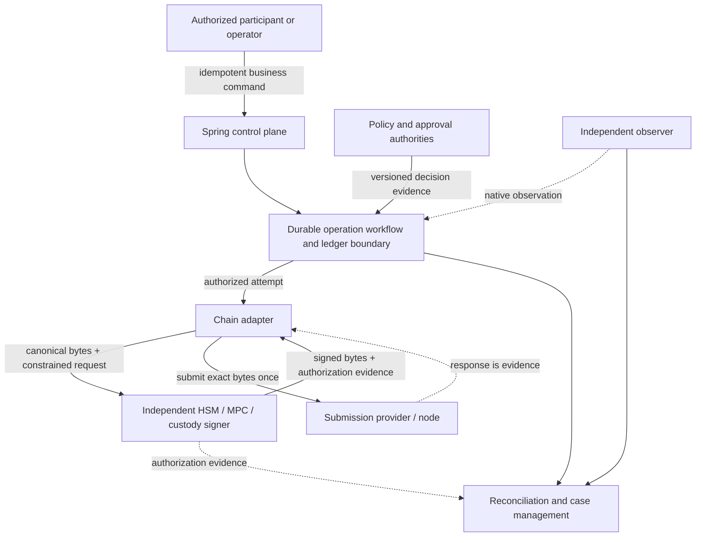
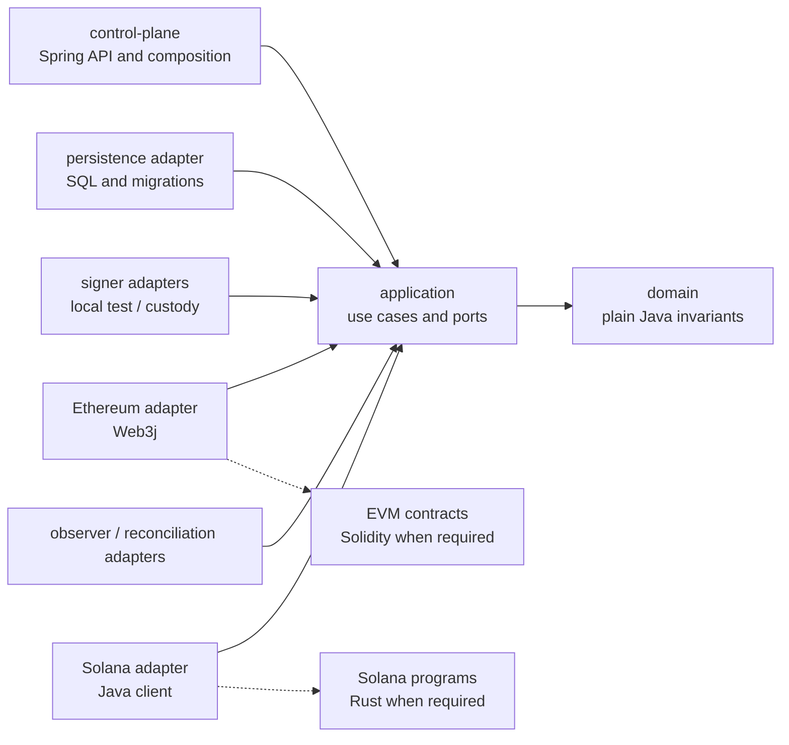
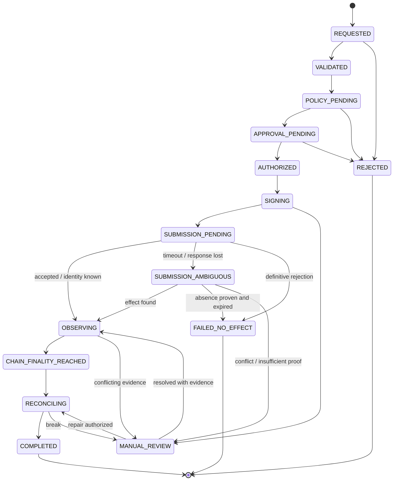

# Digital Banking Reference Implementation Design

## 1. Purpose and authority

This document is the canonical engineering design for a non-production reference implementation of a regulated digital-asset settlement control plane. It translates the verified [source publications](reference/README.md) and contextual architecture review into implementable boundaries while keeping evidence, assumptions, and unresolved decisions explicit.

The publications are architecture inputs, not code specifications. Accepted ADRs, versioned API contracts, and tests refine this design. When they disagree, resolve the conflict explicitly and update this document; do not let implementation drift become an accidental decision.

Zelle is only a public case study in the publications. This repository is organization-neutral and makes no claim about confidential or deployed Early Warning Services/Zelle systems, vendors, controls, or plans.

## 2. Goals, non-goals, and current POC boundary

### Goals

- Demonstrate a Java/Spring regulated control plane with durable, explainable operation state.
- Make mint and burn privileged asynchronous operations rather than direct private-key calls.
- Enforce exact quantity, idempotency, stable identity, approval, attempt, evidence, and reconciliation invariants.
- Isolate chain and signer technology behind ports while preserving native Ethereum and Solana semantics.
- Recover safely from duplicates, timeouts, ambiguous submission, observation disagreement, and reconciliation breaks.
- Provide independently testable layers, local infrastructure, and evidence-gated delivery.

### Non-goals

- Production deployment, legal/compliance approval, real funds, mainnet, or public testnets.
- Reproducing a Zelle product or claiming knowledge of confidential EWS architecture.
- Selecting an issuer, stablecoin, chain, bridge, custody/HSM/MPC provider, or production node provider.
- A consumer wallet, custom bridge, full cross-border product, or complete double-entry ledger in the first slices.
- Making Ethereum and Solana identical behind a lowest-common-denominator API.

### Current foundation

The current repository contains documentation, a dependency-free Java domain module boundary, and a Spring Boot control-plane application that exposes health/readiness only. There is no mint/burn API, database, signer, chain adapter, contract/program, OpenAPI document, Compose environment, or business settlement claim.

## 3. Terminology

| Term | Meaning |
| --- | --- |
| Payment intent | A durable business request and obligation context accepted from an authorized participant. A future cross-border product may own this aggregate; the initial token-operation POC does not pretend to implement the entire payment lifecycle. |
| Token operation | A privileged durable command to mint or burn an exact quantity under a configured asset, route, policy, and approval context. |
| Chain attempt | One authorized effort to create a specific external chain effect for an operation. It has a stable attempt ID even before a native transaction identity exists. |
| Submission | The one-time handoff of exact signed bytes to a submit provider. A response may be accepted, rejected, or ambiguous. |
| Observation | Evidence gathered through a materially independent read path about native transaction identity, inclusion, canonicality/commitment, logs/instructions, and effect. |
| Reconciliation evidence | A versioned comparison joining internal operation/attempt records with signer, chain, issuer/token, and accounting or inventory evidence. |
| Business truth | Durable internal operation, policy, authorization, ledger, finality, and reconciliation state. Native evidence informs this truth but does not replace it. |

These identities never collapse into one record. A payment can contain multiple token operations; an operation can contain multiple attempts; an attempt can accumulate multiple observations; reconciliation can reopen a break without rewriting history.

## 4. System context and trust boundaries

Trust does not flow transitively. The API authenticates a caller but does not grant signing authority. The signer approves exact bytes but does not decide customer, legal, or accounting finality. The submit provider can accept bytes but is not the only observation source. The observer reports native facts but cannot authorize value movement.

Personal, sanctions, fraud, case, and policy data remain inside controlled systems. If a chain reference is required, it is an opaque correlation value with no direct personal meaning.

## 5. Java/Spring control-plane responsibilities

Spring owns composition and operational interfaces. Java application/domain code owns:

- command validation and canonicalization;
- idempotent durable acceptance;
- operation and attempt identity;
- lifecycle transition guards;
- exact quantity and configured unit validation;
- policy and approval coordination;
- transactional persistence and outbox/inbox boundaries;
- worker leasing, concurrency, timers, inquiry, and case creation;
- signer and chain port orchestration;
- evidence registration, finality decisions, reconciliation, and audit queries; and
- safe administrative pause, resume, inquiry, and repair interfaces.

Spring annotations, controllers, repositories, transactions, and serialization are delivery/infrastructure concerns. Domain objects remain usable in pure tests without a Spring context.

## 6. Proposed modules and dependency direction

The verified foundation contains `domain` and `control-plane`. Phase 2 adds `application`; later executable slices may add `adapters/persistence`, `adapters/signer-*`, `adapters/ethereum-web3j`, `adapters/solana-java`, `contracts/evm`, `programs/solana`, and `integration-tests`. These paths are an ownership map, not an instruction to create empty modules. No module may depend on another chain adapter. The application layer defines capability-aware ports, while adapter-specific native types stay within the adapter and its tests.

## 7. Mint and burn operation aggregate

A token operation is the business aggregate. Its minimum durable fields are:

- `operationId`: server-issued stable identifier;
- `kind`: `MINT` or `BURN`;
- idempotency scope, key, canonicalization version, and payload hash;
- authorized participant/tenant and opaque business correlation;
- asset/unit and route configuration versions;
- exact requested quantity;
- current lifecycle state and optimistic aggregate version;
- policy, approval, and authorization evidence references;
- stable ordered attempt IDs;
- four separate finality records;
- reconciliation/case posture; and
- append-only transition timestamps, actor/workload, reason, and evidence links.

A chain attempt contains `attemptId`, `operationId`, adapter/route version, desired effect, signer request/decision evidence, canonical-bytes digest, native identity when known, submission classification, retry-safety classification, native evidence references, and observation history.

Mint and burn share lifecycle invariants but may have different authorization, token authority, inventory, and compensation policies. A common aggregate does not imply identical ledger entries or native instructions.

## 8. Asynchronous lifecycle

`REQUESTED` through `RECONCILING`, `SUBMISSION_AMBIGUOUS`, and `MANUAL_REVIEW` are non-terminal. `REJECTED`, `FAILED_NO_EFFECT`, and `COMPLETED` are terminal for the operation version. Cancellation is permitted only before an external effect is possible and becomes a distinct terminal state when implemented.

`SUBMISSION_AMBIGUOUS` is not failure and never authorizes blind resubmission. The system inquires by stable attempt/native identity, gathers independent evidence, waits for route-specific expiry/canonicality conditions, and creates a case when proof remains insufficient. A new attempt is allowed only after policy establishes that the prior attempt cannot create the effect or defines a native-safe replacement relationship.

## 9. Identity and idempotency contracts

### Idempotency key

- Supplied in `Idempotency-Key` for create-operation APIs.
- Scoped by authenticated participant/tenant and resource kind.
- Stored durably with the operation in the acceptance transaction.
- Opaque, size-bounded, and excluded from logs except a safe digest.

### Canonical payload hash

Canonicalization uses a versioned field set, Unicode normalization rule, field ordering, and exact decimal representation. Transport-only fields and JSON property order do not affect the result. The stored hash includes operation kind, participant scope, asset/unit, exact quantity, opaque business reference, and relevant request contract version.

The same scope/key/hash returns the original operation and never creates a new effect. The same scope/key with a different hash returns an idempotency conflict. Changing canonicalization requires versioning and compatibility tests.

### Operation and attempt IDs

Operation IDs are generated before any external interaction and are never reused. Attempt IDs are generated before signing and remain stable through submission, inquiry, observation, and reconciliation. Native transaction hashes/signatures can be unknown or replaced; they do not become the attempt's primary key.

## 10. Exact amount and unit representation

- API quantities are canonical base-10 strings, never JSON binary floating-point numbers.
- The asset/unit registry supplies a stable unit identifier, non-negative scale, native decimals, maximum magnitude, and encoding version. Callers do not choose scale independently.
- Domain arithmetic uses integer atomic/minor units (`BigInteger` is the current design candidate) plus an immutable unit definition. Any display `BigDecimal` is derived and never the authoritative stored quantity.
- Input with excess precision is rejected. A conversion that can lose value requires an explicitly named rounding mode and policy; mint/burn default to exact conversion with no rounding.
- Addition/comparison requires identical units and compatible versions. Cross-unit conversion is a separate priced operation, not arithmetic convenience.
- Persistence and native encoding validate magnitude before conversion. Overflow, truncation, scientific notation, non-canonical zero, negative quantities, and unsupported scale fail deterministically.
- String serialization round-trips exactly and has golden tests across API, persistence, signer request, and adapter boundaries.

Phase 2 turns this design into concrete types and tests without selecting a database numeric column.

## 11. Chain adapter capability contract

The common port coordinates a lifecycle, not a generic transaction:

- `capabilities(routeVersion)` describes supported operation kinds and evidence/retry characteristics;
- `prepare(operation, attempt)` produces canonical unsigned bytes/digest plus a redacted build-evidence reference;
- `submitOnce(signedAttempt)` submits the exact signed bytes once and classifies the response as accepted, definitively rejected, or ambiguous;
- `inquire(attemptIdentity)` determines known native identity/effect and route-specific retry safety; and
- `observe(nativeIdentity, policyVersion)` returns normalized status plus versioned native evidence.

The common result includes operation/attempt correlation, an opaque native identity, observed effect, evidence schema/version, source, observed time, and policy-relevant confidence. It does not make native semantics disappear. Adapter-owned native evidence remains queryable and reconcilable in a versioned schema.

### Ethereum semantics preserved

The Ethereum adapter owns chain ID, sender, nonce reservation, exact signed transaction bytes, transaction hash, replacement lineage, receipt status/logs, block number/hash, confirmation threshold, canonicality, and reorg handling. A timeout triggers inquiry by transaction hash and sender/nonce evidence. A replacement is a related attempt under explicit fee/nonce policy, not an unrelated retry.

### Solana semantics preserved

The Solana adapter owns cluster identity, fee payer/authority, recent blockhash or durable-nonce choice, last valid block height/lifetime, exact message/instructions/accounts, transaction signature, slot, commitment progression, program logs, and expiry. Resubmitting the same signed transaction during its lifetime differs from building a transaction with a new blockhash; that distinction is explicit in attempt lineage and retry policy.

No shared enum may imply that an EVM receipt confirmation and a Solana commitment have identical meaning.

## 12. Signer and custody authority port

`Signer` accepts a provider-neutral `SigningRequest` containing:

- operation and attempt IDs and purpose (`MINT`/`BURN`);
- chain/route and asset/unit configuration versions;
- exact quantity, source/authority, destination, contract/program and method/instruction identity;
- canonical unsigned bytes and digest;
- nonce/blockhash/lifetime or an opaque adapter-native constraint digest;
- fee ceiling, expiry, allowlist, and simulation/result evidence;
- policy version and approval/quorum evidence; and
- idempotent signer request identity.

It returns an approved or rejected `SigningDecision` with key reference (never key bytes), signed payload/signature, digest, decision reason, signer policy version, authorization evidence, and provider request identity.

The signer independently reproduces or verifies critical constraints against the canonical bytes. It rejects mismatches. HSM, MPC, qualified custody, and an isolated local-development signer implement the port. The local signer is test-only, uses disposable local-chain fixtures, and cannot load production configuration.

## 13. Ethereum/Web3j boundary

The Ethereum-first chain slice uses Foundry as the only EVM contract toolchain: `forge` for build and native tests, `anvil` for the local chain, `cast` for diagnostics, and Foundry scripts for deployment when needed. Web3j belongs only in the Java Ethereum adapter and may provide typed JSON-RPC, deterministic encoding, generated bindings, receipt/event decoding, and node interaction. Foundry artifacts and Web3j types never cross the adapter boundary.

Solidity is added only if the vertical slice needs a minimal local token or authority contract. Any external contract source is reference evidence until a reviewed commit/tag is pinned and its license and security posture are recorded. Contract choice, admin/upgrade model, mint/burn authorization, pause/denylist behavior, event schema, and dependency versions require native security tests and a decision update when they become concrete. See [ADR 0002](adr/0002-evm-foundry-and-web3j.md).

## 14. Solana Java-client and Rust-program boundary

The Solana slice uses native SVM semantics and the classic SPL Token Program for its initial Circle-USDC-aligned local path. A bounded Sava spike must first prove Java 25 compatibility, required instruction/RPC coverage, deterministic message construction, maintained release provenance, and acceptable dependency/authentication mechanics. No SDK dependency is selected merely because it is listed by Solana documentation. The Java adapter owns RPC, message, instruction, account, lifetime, and commitment integration and translates only normalized outcomes across the port.

Rust with Anchor is introduced only when required business logic cannot safely use an existing audited program. That later decision must pin toolchain/program dependencies, define accounts/PDAs and upgrade authority, and establish formatter, linter, native tests, local validator, and client/program integration commands. Neon is excluded from this native-SVM baseline; reconsideration requires a distinct EVM-compatibility requirement and a new ADR. Direct issuer-authority mint/burn is not CCTP: CCTP is a separate cross-chain burn, attestation, and destination-mint workflow. Official Circle and Solana repositories remain reference evidence until a reviewed dependency is explicitly consumed and pinned. See [ADR 0003](adr/0003-native-solana-spl-token.md).

## 15. API boundary

The proposed versioned resources are:

- `POST /v1/token-operations/mints`;
- `POST /v1/token-operations/burns`; and
- `GET /v1/token-operations/{operationId}`.

Create requests require authentication/authorization, `Idempotency-Key`, a contract version, asset/unit identifier, canonical quantity string, and opaque correlation reference. The server derives route, contract/program, signer, policy, and finality configuration; callers do not inject arbitrary destinations or RPC fields.

Accepted creation returns HTTP 202 with the stable operation resource and `Location`. Duplicate same-payload requests return the same operation representation. A key/payload mismatch returns a conflict. Validation, policy rejection, authorization rejection, and service unavailability use explicit problem types.

Status exposes business lifecycle, non-sensitive evidence references, attempt summaries, and distinct finalities. It does not expose raw policy data, personal data, secret provider identifiers, signed raw transactions by default, or a single `settled` Boolean.

No business resource is implemented until durable acceptance and idempotency exist. The foundation exposes health/readiness only.

## 16. Persistence, transactions, outbox/inbox, and concurrency

The durable API slice will use a relational database. One local transaction accepts the idempotency record, operation aggregate, initial transition/audit record, and outbox message. A uniqueness constraint enforces idempotency scope/key. Optimistic aggregate versioning or explicit row locking protects transitions.

External signing/submission never occurs inside a database transaction. Workers claim work through bounded leases and compare-and-set state/version guards. The outbox transports commands/events; it is not business authority. Consumers use inbox/deduplication records and monotonic version guards.

Attempt creation, authorization evidence, and canonical digest are durable before signing/submission. Submission classification is recorded after the call; process death at that boundary produces inquiry, not automatic resubmission.

Corrections append transitions, reversals, or adjustment records. They do not destructively edit accepted business history.

## 17. Independent observation and reconciliation

The submit provider's response is never the only observation source. An observer uses a separately configured endpoint/provider or other materially independent path where practical. It records source, request parameters, observed time, native block/slot identity, canonicality/commitment, effect, and raw-evidence hash/reference.

Reconciliation joins:

- operation and attempt lineage;
- signer authorization and signed-payload digest;
- submit-provider record;
- independent chain observation;
- token supply/authority or account-balance effect where applicable;
- internal ledger/inventory postings when implemented; and
- issuer/custody statements when available.

Differences create durable breaks with owner, severity, age, evidence, disposition, and repair authorization. Repair never fabricates missing evidence or rewrites the original attempt.

## 18. Four finalities

| Finality | Authority and evidence | Initial POC posture |
| --- | --- | --- |
| Blockchain finality | Route-specific chain-risk policy applied to independent native evidence and canonicality/commitment thresholds. | Implemented first in each chain slice; no legal meaning implied. |
| Legal settlement finality | Counsel/product policy applied to parties, instrument, corridor, agreements, law, and remedies. | Represented as distinct `not_assessed`/external evidence state; not decided by the POC. |
| Customer-visible completion | Product/participant authority applied to required debit/reservation, recipient credit or approved remedy, and disclosure state. | Kept distinct and normally `not_assessed` until a future product flow exists. |
| Accounting finality | Controller/accounting authority applied to balanced journals, valuation, reconciliation, break disposition, and period close. | Kept distinct and `not_assessed`; the POC does not claim a complete ledger/close. |

The POC therefore models the four slots and their evidence provenance but initially derives only blockchain finality. Operation `COMPLETED` in a narrow technical slice means its explicitly configured acceptance gate passed; it never silently claims legal, customer, or accounting finality.

## 19. Error taxonomy, retry safety, and compensation

| Class | Example | Default posture |
| --- | --- | --- |
| Request invalid | malformed quantity, unsupported unit, missing idempotency key | Reject before durable effect. |
| Idempotency conflict | same scoped key, different canonical hash | Return conflict; never create another operation. |
| Policy/approval rejected | limit, allowlist, quorum, expired approval | Terminal rejection with evidence; no signing. |
| Deterministic build/sign failure | invalid route config, canonical mismatch | Pause/reject attempt; operator/config repair before retry. |
| Definitive submission rejection | provider proves bytes were not accepted | Record no-effect failure; new attempt only if policy authorizes. |
| Ambiguous submission | timeout, disconnect, lost response | Inquiry and observation; no blind resubmission. |
| Native execution failure | reverted EVM receipt, Solana instruction error | Record native evidence; assess compensation/new business operation. |
| Observation conflict | providers disagree, reorg, commitment regression | Hold progression, gather evidence, open case. |
| Reconciliation break | supply/balance/ledger mismatch | Stop affected route/value band as policy requires; repair with authorized append-only evidence. |
| Operator/security halt | suspect signer, limit breach, provider incident | Stop new obligations; preserve inquiry/recovery capability. |

Retries repeat an idempotent technical read or the exact same safe request identity. A new value-moving attempt requires explicit proof and authorization. Compensation is a separate durable business operation or ledger correction with its own identity and approvals; it does not erase the original effect.

## 20. Security model

- Role and attribute checks separate requester, approver, signer authority, operator, observer, reconciler, and auditor.
- Value bands, velocity limits, destinations, assets, chains, contracts/programs, methods/instructions, fee caps, and validity windows are versioned policy.
- High-risk operations require quorum/four-eyes approval over the exact digest.
- Application code never stores production raw keys; signer adapters receive only provider references and approved payloads.
- Development signing is local-only, disposable, clearly named, and denied in production profiles.
- Audit evidence binds actor/workload, intent, canonical payload hash, policy/config versions, approvals, exact digest, signer decision, native identity, observations, transitions, and reconciliation.
- Kill switches prevent new work while leaving evidence inquiry and reconciliation available.
- Dependencies, contracts, programs, generated bindings, and provider SDKs receive security review before promotion.
- Logs and telemetry redact idempotency keys, raw signed bytes, secrets, personal data, and sensitive policy facts.

This repository provides design discipline, not a threat-model completion or compliance claim.

## 21. Observability versus immutable business audit

Operational observability includes metrics, traces, and structured logs for latency, queue depth, attempt age, ambiguous outcomes, provider health, finality lag, and reconciliation breaks. It may be sampled, aggregated, or retained for a limited period.

Business audit is durable, complete, append-only evidence for authorization and financial state. It records stable identities, versions, transitions, reasons, and evidence hashes/references. Trace IDs can link the two, but a log line cannot substitute for an audit record and an audit record should not contain secret telemetry payloads.

## 22. Local development and test topology

Foundation topology is one JVM process with in-memory Spring context and Actuator health tests. No external service is required.

Later phases add components only as needed:

1. relational database plus migrations and concurrency tests;
2. deterministic development signer/test double;
3. Anvil as the local EVM chain for Ethereum;
4. local Solana validator for Solana;
5. independent observer endpoints/processes;
6. Compose orchestration after individual slices are deterministic; and
7. end-to-end fixtures and operator runbooks.

Local chains use disposable deterministic fixtures and no public RPC credentials. Tests must cover restarts, duplicate delivery, timeouts, ambiguous effects, reorg/commitment changes, and reconciliation breaks before a slice is verified.

## 23. Decisions, assumptions, unknowns, and deferred work

### Accepted decisions

- Java 25 and Spring Boot 4.0.6 / Spring Framework 7.0.x baseline.
- Maven reactor with plain `domain` and Spring `control-plane` modules; see ADR 0001.
- Health/readiness is the only foundation endpoint.
- Chain and signer dependencies are deferred until a tested slice.
- The common domain/lifecycle slice precedes either chain slice.
- Ethereum is the first chain slice; Foundry owns EVM contract development and Web3j stays in its Java adapter; see ADR 0002.
- Solana uses native SVM semantics and classic SPL Token first; Sava must pass a bounded evaluation before selection; see ADR 0003.
- Rust/Anchor is conditional on business logic that existing programs cannot safely supply; Neon is outside the baseline.
- Direct authority mint/burn and CCTP are separate workflows.

### Assumptions to validate

- A relational database is the right first durable store.
- Integer atomic/minor units plus versioned unit definitions cover the first asset scope.
- One approved asset/network/authority configuration is sufficient for each initial chain slice.
- A materially independent local observation path can be demonstrated for each local chain.

### Unknowns requiring future evidence or ADRs

- Issuer/asset, legal claim, mint/burn authority, reserve/redemption model, and permitted participants.
- Whether Sava passes the bounded Java-client evaluation and which exact release can be pinned.
- Whether later Solana business requirements justify a custom Rust/Anchor program.
- Custody/HSM/MPC provider and authorization interface details.
- Database, workflow engine versus database-backed worker, OpenAPI versioning, and messaging topology.
- Chain finality thresholds, replacement/expiry policies, limits, and reconciliation tolerances.
- Customer and accounting systems that would own their respective finalities.

### Deferred

Production readiness, cloud/CI deployment, bridge design, consumer wallet, double-entry ledger completeness, broker topology, vendor selection, SBOM/threat hardening, public testnet/mainnet, and compliance/legal certification are intentionally outside this foundation.

## 24. Traceability to the source publications

The table identifies conceptual inputs, not normative code requirements.

| Design area | Executive brief sections | Full reference architecture sections |
| --- | --- | --- |
| Product/evidence boundary and non-goals | 1, 2, 6, 12 | Abstract; 1; 2; 3; H |
| Layered control plane and trust boundaries | 3; 4 decisions 1, 2, 4 | 4; 4.1-4.3; 5; A; A.1 |
| Ledger/business truth and durable lifecycle | 1; 3; 4 decisions 1 and 3 | 6; 7; 8; 9; E; F |
| Idempotency, ambiguity, and reconciliation | 3; 6; 9; 10 | 7-11; B; E; F |
| Four finalities | 4 decision 3 | 12; E; J |
| Signing and security authority | 4 decision 8; 7; 10 | 13; 13.1-13.2; 14; A |
| Java/native and module boundaries | 4 decisions 4 and 5; 8 | 15; 15.1; 16; C |
| Ethereum/Solana differences | 5; 8 | 16.2-16.4; C |
| Evidence-gated delivery and exit | 6; 9; 10; 11 | 18; 19; D |

Full titles, publication versions, normalized paths, source-commit provenance, and verified SHA-256 checksums are recorded in [`docs/reference/README.md`](reference/README.md).
