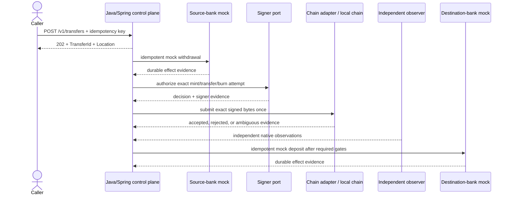

# Planned Bank-to-Bank Stablecoin Transfer Demonstration

## Purpose, audience, and status

This document specifies a local-only, non-production proof of concept for bank-to-bank value movement using a stablecoin settlement rail. It is a proposed capability contract subordinate to accepted [ADRs](adr/README.md), the canonical [design](DESIGN.md), and future executable tests.

**Status:** `planned`. The repository does not currently implement the end-to-end flow, transfer resource, bank integration, settlement wallets, signing, chain effects, observation, or reconciliation. Phase 3A only durably accepts and reads back mint/burn operation requests; it does not process them.

Intended reviewers are application engineers, architects, smart-contract and program engineers, security and operations teams, and interview reviewers. This demonstration never implies production, legal, accounting, compliance, or operational readiness.

## Business scenario and public API

One caller-owned asynchronous transfer resource coordinates five internal effects:

1. mock withdrawal from the sender's bank account;
2. mint the stablecoin to the sender's settlement wallet;
3. transfer the stablecoin to the recipient's settlement wallet;
4. burn the stablecoin from the recipient's settlement wallet; and
5. mock deposit to the recipient's bank account.

The planned public API is:

```text
POST /v1/transfers
GET  /v1/transfers/{transferId}
```

`POST /v1/transfers` requires a 1-128 character visible-US-ASCII `Idempotency-Key` and accepts:

- opaque sender and recipient mock-bank account references;
- exact `amount` as a canonical decimal string and a configured `currency` identifier; and
- an optional logical `settlementNetwork`, initially `ETHEREUM` or `SOLANA`.

Participant/tenant scope comes only from the authenticated principal, never request JSON or an ad hoc tenant header. Creation requires the planned transfer-create authority; read-back requires the planned transfer-read authority. `GET` is participant-scoped, so an unknown transfer ID and another participant's transfer ID produce the same safe 404 response.

The server resolves currency scale, stablecoin asset/unit, settlement wallets, signer policy, chain endpoint, contract/program identity, finality thresholds, and route configuration. The network choice is not arbitrary infrastructure input: it is validated against an allowlisted, versioned local route configuration. Callers never provide RPC URLs, contract/program addresses, signer or key references, key material, or finality thresholds. If the field is absent, the server selects the configured local default.

Acceptance returns HTTP 202 with a stable `TransferId`, a transfer representation, and `Location: /v1/transfers/{transferId}` only after durable local acceptance commits. `GET` returns the durable parent status, child summaries, distinct finalities, and explicitly allowlisted evidence summaries. It does not return raw idempotency keys, internal digests, private account data, policy facts, signer/provider details, signed bytes, or a single `settled` Boolean.

The caller does not orchestrate five public commands. Test-only inspection or administration endpoints, if later justified, remain separate from the business API and disabled outside the local profile.

## Aggregate, identity, and authority

One durable transfer aggregate owns the business request and child-effect correlation:

```text
TransferId
  -> source-bank effect ID and attempt IDs
  -> mint OperationId and chain AttemptIds
  -> transfer OperationId and chain AttemptIds
  -> burn OperationId and chain AttemptIds
  -> destination-bank effect ID and attempt IDs
  -> observations, finality records, reconciliation, and cases
```

The parent records participant scope, canonical request version/hash, exact amount/currency, route/configuration versions, authorization and limit decisions, settlement-wallet roles, child identities, current state/version, four finality histories, and append-only evidence. Each child effect has its own stable identity before an external call. A native transaction hash or signature is nullable attempt evidence, never the parent identity.

The same scoped idempotency key, canonicalization version, and request hash returns the original transfer. The same scope/key with a different canonical identity is a conflict. Duplicate delivery cannot create another parent, child operation, attempt, or external effect.

Authorization, participant limits, currency/asset mapping, chain route, wallet roles, signer policy, approvals, and finality policy are server-owned, allowlisted, and versioned. A signing request binds exact bytes/digest to the parent transfer, child operation, attempt, purpose, route, asset, quantity, source/destination, fee/lifetime limits, policy, and approval evidence. Raw production keys never enter the Java application.

## Workflow and transaction boundary

The transfer is an asynchronous saga/workflow with narrow local transactions, not one distributed transaction spanning a bank adapter and blockchain. A provider-neutral process manager coordinates work through domain commands and ports. It does not become the authoritative ledger or bypass domain transitions.



Every step transition records expected/new aggregate version, actor or workload, reason, policy/configuration versions, timestamp, and append-only evidence references. Transactional outbox/inbox delivery, durable timers, leases, retries, deduplication, and restart recovery prevent in-memory progress from becoming business truth.

After ambiguous chain submission, the process manager inquires and independently observes the original attempt before progression or any newly authorized attempt. A timeout is not proof of failure. Blockchain, legal settlement, customer-visible, and accounting finalities remain separate authority/evidence records.

A confirmed external effect is never destructively rolled back. Compensation is a new authorized bank effect, token operation, or ledger correction with its own stable identity, approval, attempts, evidence, and reconciliation.

## BPM and durable-workflow boundary

The repository defines orchestration as a logical control-plane capability, not a selected product. It currently implements domain transitions and durable acceptance/outbox foundations, but no complete process worker or BPM engine.

> In an enterprise deployment, the transfer workflow may be executed by an organization's existing approved BPM or durable-workflow platform, provided it satisfies the repository's state-versioning, idempotency, durable timer, retry, recovery, audit/export, availability, and evidence requirements. The BPM engine coordinates work; it does not replace the domain state machine, authoritative ledger, policy/approval controls, signer boundary, independent observation, or reconciliation records.

Action Request 05 supplies one explicitly labeled inference from a job description: an application-owned Java/Spring state machine with Oracle persistence and Kafka, JMS, or TIBCO EMS messaging is the most plausible existing organizational pattern. This is not a discovered Zelle/Early Warning Services implementation fact. Kafka, JMS, and TIBCO EMS are messaging transports, not BPM engines or financial-state authorities.

TIBCO BusinessWorks/BPM Enterprise, MuleSoft, and SAP integration products are possible organization-standard integration or process platforms only if organizational evidence establishes their use. Integration flows never replace the domain state machine or authoritative ledger. The self-contained reference baseline remains a database-backed Java/Spring worker unless a later evidence spike and ADR select another runtime.

If a new durable-workflow platform is evaluated, compare:

- Camunda 8 for BPMN, human tasks, case/operations visibility, and first-class Java/Spring integration; and
- Temporal for code-first Java workflows, durable execution, timers, retries, and crash recovery. Temporal's Java/Spring SDK experience does not make its server a Java runtime.

Candidates are evaluated against state ownership, deterministic/versioned behavior, idempotency, durable timers, ambiguous-effect recovery, human tasks, audit/export, availability and disaster recovery, security, operational ownership, deployment constraints, licensing, and exit/migration strategy. No workflow-platform dependency is added without a focused evidence spike and ADR. No vendor is selected by this specification.

## Five-step evidence and retry contract

| Step | Owner / port | Durable evidence | Success condition | Ambiguity or failure | Safe retry posture |
| --- | --- | --- | --- | --- | --- |
| 1. Source-bank mock withdrawal | Process manager through `SourceBankPort`; local adapter or stub service | Bank-effect ID, idempotency identity, request hash, account reference hash, exact amount/currency, response classification, timestamp, and mock journal/effect reference | The configured mock debit/reservation is durably recorded and independently readable by stable effect ID | Timeout remains `BANK_EFFECT_AMBIGUOUS`; inquire by effect ID. Definitive rejection stops before mint. Any mismatch opens a case | Repeat inquiry or the same idempotent request identity. Never create another withdrawal merely because the response was lost |
| 2. Mint to sender settlement wallet | Token-operation service through signer and chain ports | Parent/child IDs, mint `OperationId`, `AttemptId`, exact asset/quantity, sender-wallet role, signer decision, canonical digest, native identity, observation, and blockchain-finality evidence | Independent observation proves the authorized mint effect under the configured local finality policy | Rejection, expiry, native failure, or ambiguous submission is recorded. Ambiguity requires inquiry/observation; no transfer begins without required mint evidence | Resend identical signed bytes only when native policy permits. A new attempt requires proof that the prior attempt cannot create an unintended duplicate effect |
| 3. Transfer to recipient settlement wallet | Transfer child operation through signer and chain ports | Transfer operation/attempt IDs, sender/recipient wallet roles, exact quantity, authorization, digest, native identity, logs/instructions, observation, and finality evidence | Independent observation proves the exact sender-to-recipient wallet effect and route policy allows progression | Insufficient balance, native failure, response loss, provider disagreement, reorg, commitment regression, or expiry holds progression and may open a case | Inquire and observe the original attempt. EVM replacement preserves sender/nonce lineage; Solana same-signed resend differs from a new-blockhash attempt |
| 4. Burn from recipient settlement wallet | Token-operation service through signer and chain ports | Burn `OperationId`, `AttemptId`, exact quantity, recipient-wallet role, signer decision, digest, native identity, observation, supply/account effect, and finality evidence | Independent observation proves the authorized burn and required policy gates pass | Rejection or ambiguity cannot be treated as no effect. A confirmed transfer followed by failed burn requires an authorized recovery/compensation decision | Same inquiry and native-safe attempt rules as mint. Never create a new parent transfer or blind-resubmit after timeout |
| 5. Destination-bank mock deposit | Process manager through `DestinationBankPort`; local adapter or stub service | Bank-effect ID, idempotency identity, request hash, account reference hash, exact amount/currency, prerequisite evidence set, response classification, timestamp, and mock journal/effect reference | The configured mock credit is durably recorded and independently readable after required burn/finality gates | Timeout remains ambiguous and is inquired by stable effect ID. Definitive rejection or mismatch creates a case and a new authorized compensation path | Repeat inquiry or the same idempotent request identity. Any compensating debit/credit is a separately authorized effect, never mutation of history |

Bank account references are opaque and local. Bank adapters never make chain or signing decisions, and chain adapters never authorize bank effects. The parent advances only when the configured evidence gates for the preceding child are satisfied.

## Chain realization

### Ethereum local demonstration

Foundry owns Solidity build, tests, Anvil, diagnostics, and deployment scripts under the future `contracts/evm/` tree. A minimal local stablecoin contract must support the demonstrated authorized mint, ERC-20 transfer, and authorized burn semantics. Web3j remains confined to the Java Ethereum adapter. The adapter preserves chain ID, sender, nonce and replacement lineage, exact signed bytes/hash, receipt status/logs, block identity, confirmations, canonicality, and reorganization evidence.

### Solana local demonstration

Use native SVM semantics and the classic SPL Token Program. The initial local realization creates an SPL token mint plus sender and recipient token accounts and exercises native mint, transfer, and burn instructions. The Java client must pass the bounded evaluation required by [ADR 0003](adr/0003-native-solana-spl-token.md). Do not introduce Neon. Do not add a custom Rust/Anchor program unless existing programs cannot safely express a required business rule and a later ADR approves it.

These are proposed future executable locations; this action creates none of them:

```text
adapters/bank-mock/
adapters/signer-local/
adapters/chain-ethereum-web3j/
adapters/chain-solana/
contracts/evm/
programs/solana/        # only if a custom native program is later justified
integration-tests/
```

ADRs 0002 and 0003 explicitly select `adapters/ethereum-web3j/` and `adapters/solana-java/`. The different adapter names in the Action Request's required proposed-path list above are provisional. The accepted ADR paths remain authoritative unless a later ADR supersedes them; the focused chain plans must reconcile the names before creating code. This document does not silently create or rename implementation modules.

## Wallets, keys, and configuration

- Commit no private key, seed phrase, API key, RPC credential, funded address, `.env` file, keystore, signer credential, or real bank identifier.
- Generate or provision local-chain wallet authorities as disposable test fixtures in ignored runtime storage. They are not staging or production identities.
- Keep production-oriented HSM/MPC/custody signing behind the provider-neutral signer port using non-secret key references; raw private keys never enter Java application memory, logs, exceptions, fixtures, or traces.
- Inject future RPC, database, and provider credentials through approved external configuration and secret mechanisms. A future `.env.example`, if justified, contains names and obvious safe placeholders only.
- Make local signer and bank-mock adapters impossible to enable through a production profile. Default configuration contains no public-network endpoint or production authority.

## Completion criteria

Completion is two separate claims, never one blended multi-chain claim:

1. **Ethereum local end-to-end transfer** - the five steps complete on Anvil through the Ethereum adapter with durable correlation, deterministic deployment/encoding, independent receipt/log observation, idempotent duplicate delivery, restart recovery, timeout inquiry, replacement/canonicality handling, and clean-room local instructions.
2. **Solana local end-to-end transfer** - the same business contract completes on a local validator through native SPL Token mint/transfer/burn and account setup while preserving message/instruction/account evidence, blockhash lifetime, signature/slot/commitment progression, independent observation, idempotent duplicate delivery, restart recovery, and clean-room local instructions.

Each claim requires all five steps to be durably correlated, independently observable where applicable, safe under duplicate delivery, and recoverable across restart and timeout ambiguity. Completing either local demonstration still does not imply production, legal, accounting, compliance, security-certification, or operational readiness.
